# R-CNN 逐段翻译精读

> 论文：Ross Girshick, Jeff Donahue, Trevor Darrell, Jitendra Malik, *Rich Feature Hierarchies for Accurate Object Detection and Semantic Segmentation*，arXiv v5，2014-10-22。  
> 精读范围：全文，包括摘要、正文 `1` 到 `6` 节，以及附录 `A` 到 `G`。  
> 阅读方法：下文严格沿论文行文顺序展开。每个“段落”对应原文中的一个自然段、图注或表注；译文为忠实中文转述，随后解释本段要解决的问题。
> 原文对照说明：请同时打开本地论文 [`1311.2524v5.pdf`](1311.2524v5.pdf)，依照标题与段落编号逐段阅读英文原文；本讲义不重复转载完整英文正文。

## Abstract 摘要

### 摘要第 1 段：论文要解决什么问题

**原文对照**

> Object detection performance, as measured on the canonical PASCAL VOC dataset, has plateaued in the last few years. The best-performing methods are complex ensemble systems that typically combine multiple low-level image features with high-level context. In this paper, we propose a simple and scalable detection algorithm that improves mean average precision (mAP) by more than 30% relative to the previous best result on VOC 2012—achieving a mAP of 53.3%. Our approach combines two key insights: (1) one can apply high-capacity convolutional neural networks (CNNs) to bottom-up region proposals in order to localize and segment objects and (2) when labeled training data is scarce, supervised pre-training for an auxiliary task, followed by domain-specific fine-tuning, yields a significant performance boost. Since we combine region proposals with CNNs, we call our method R-CNN: Regions with CNN features. We also compare R-CNN to OverFeat, a recently proposed sliding-window detector based on a similar CNN architecture. We find that R-CNN outperforms OverFeat by a large margin on the 200-class ILSVRC2013 detection dataset.

**译文**

在标准的 PASCAL VOC 数据集上，目标检测性能在此前几年已经进入平台期。当时表现最好的方法通常是复杂的集成系统，将多种底层图像特征与高层上下文结合起来。本文提出一种简单且可扩展的检测算法，在 VOC 2012 上取得 `53.3% mAP`，相对于此前最佳结果提高超过 `30%`。方法包含两个关键认识：第一，可以将高容量卷积神经网络（CNN）应用于自底向上的区域候选，以定位和分割物体；第二，当带标注训练数据不足时，先针对辅助任务进行有监督预训练，再针对目标领域微调，能显著提高性能。由于本方法把区域候选与 CNN 结合起来，作者将其命名为 **R-CNN：Regions with CNN features**。作者还将 R-CNN 与基于相似 CNN 结构的滑动窗口检测器 OverFeat 比较，发现 R-CNN 在 200 类 ILSVRC2013 检测任务上大幅优于 OverFeat。

**重点**

- 论文不是简单把 CNN 用于分类，而是要把 CNN 引入 **目标检测**。
- 两项贡献提前在摘要中给出：`region proposals + CNN`；`supervised pre-training + domain-specific fine-tuning`。
- `mAP` 是检测任务的主要指标；摘要结果已经表明该方法不是小改进。

**问题与解答**

- **问题：R-CNN 名字中的 `R` 是什么？**  
  `R` 指 Regions，即区域候选；CNN 不直接只看整张图，而是表示许多可能含物体的区域。
- **问题：为什么摘要强调“简单且可扩展”？**  
  与需要拼装多种手工特征和上下文模块的检测系统相比，R-CNN 的主体流程清晰；而 4096 维特征和线性分类器也使类别数扩展更容易。

---

# 1 Introduction

### 第 1 段：Features matter

**原文对照**

> Features matter. The last decade of progress on various visual recognition tasks has been based considerably on the use of SIFT [29] and HOG [7]. But if we look at performance on the canonical visual recognition task, PASCAL VOC object detection [15], it is generally acknowledged that progress has been slow during 2010-2012, with small gains obtained by building ensemble systems and employing minor variants of successful methods.

**译文**

特征至关重要。过去十年中，各种视觉识别任务的进展很大程度上建立在 `SIFT` 与 `HOG` 特征之上。然而，如果考察典型的视觉识别任务 PASCAL VOC 目标检测，人们普遍承认 2010 到 2012 年间进展缓慢，改进主要来自构建集成系统以及对成功方法进行小幅变体调整。

**重点**

- 作者首先把瓶颈归因于 **表示能力**：传统手工特征已经推动过进展，但新的提升困难。
- 后文 R-CNN 的价值要与传统 HOG/SIFT 基线比较才成立。

**问题与解答**

- **问题：作者为什么不从 CNN 结构细节开讲？**  
  因为论文的论证主线是“更强的特征表示改变检测性能”，先建立传统特征平台期，才能说明 CNN 特征的意义。

### 第 2 段：从浅层特征到层次特征

**原文对照**

> SIFT and HOG are blockwise orientation histograms, a representation we could associate roughly with complex cells in V1, the first cortical area in the primate visual pathway. But we also know that recognition occurs several stages downstream, which suggests that there might be hierarchical, multi-stage processes for computing features that are even more informative for visual recognition.

**译文**

SIFT 与 HOG 都属于分块方向直方图表示，可以粗略类比为灵长类视觉通路第一皮层区域 V1 中复杂细胞的响应。但识别过程实际发生在视觉处理的更下游阶段，这暗示：用于视觉识别的特征计算可能也需要层次化、多阶段的过程，并且这样的表示可能信息量更强。

**重点**

- HOG/SIFT 主要刻画局部梯度与边缘；作者需要一种能逐层形成更高级模式的表示。
- “Rich feature hierarchies” 标题中的层次表示，在本段建立动机。

**问题与解答**

- **问题：这里是否是在证明 CNN 与人脑完全相同？**  
  不是。作者只是以生物视觉作为直觉类比，技术结论依赖后续检测实验。

### 图 1：目标检测系统概览

**原文对照**

> Figure 1: Object detection system overview. Our system (1) takes an input image, (2) extracts around 2000 bottom-up region proposals, (3) computes features for each proposal using a large convolutional neural network (CNN), and then (4) classifies each region using class-specific linear SVMs. R-CNN achieves a mean average precision (mAP) of 53.7% on PASCAL VOC 2010. For comparison, [39] reports 35.1% mAP using the same region proposals, but with a spatial pyramid and bag-of-visual-words approach. The popular deformable part models perform at 33.4%. On the 200-class ILSVRC2013 detection dataset, R-CNN's mAP is 31.4%, a large improvement over OverFeat [34], which had the previous best result at 24.3%.

**译文**

系统先接收输入图像，随后提取约 2000 个自底向上的区域候选；对每个候选区域使用大型 CNN 计算特征；最后用类别专属的线性 SVM 对每个区域分类。R-CNN 在 PASCAL VOC 2010 上达到 `53.7% mAP`。作为比较，在相同区域候选条件下，空间金字塔加词袋特征的方法达到 `35.1% mAP`，流行的 DPM 达到 `33.4% mAP`。在包含 200 类的 ILSVRC2013 检测数据集上，R-CNN 达到 `31.4% mAP`，高于此前最佳 OverFeat 的 `24.3%`。

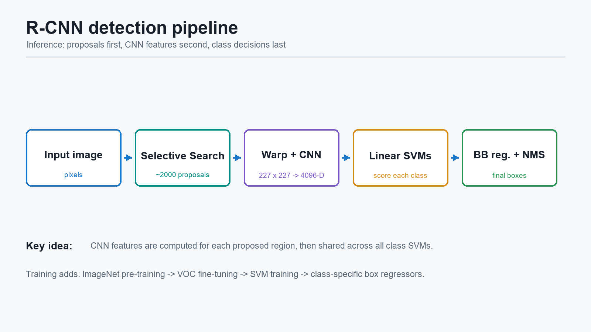

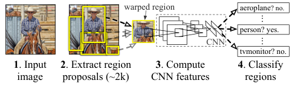

**重点**

- 图 1 给出整篇论文最重要的流程：`proposals -> CNN features -> SVM classification`。
- 与 UVA 系统比较时 proposal 相同，因此大的性能差异有力地指向 **CNN 特征**。

**问题与解答**

- **问题：图 1 中为什么还没有画 bounding-box regression？**  
  图 1 表达检测主体；作者在错误分析后才引入边界框回归作为定位改进。

### 第 3 段：CNN 的历史来源

**原文对照**

> Fukushima's "neocognitron" [19], a biologically-inspired hierarchical and shift-invariant model for pattern recognition, was an early attempt at just such a process. The neocognitron, however, lacked a supervised training algorithm. Building on Rumelhart et al. [33], LeCun et al. [26] showed that stochastic gradient descent via backpropagation was effective for training convolutional neural networks (CNNs), a class of models that extend the neocognitron.

**译文**

Fukushima 提出的“neocognitron”是一种受生物启发、具有层次性和位移不变性的模式识别模型，是较早尝试实现上述层次处理过程的方法。不过，neocognitron 缺少有监督训练算法。在 Rumelhart 等人的研究基础上，LeCun 等人证明了通过反向传播进行随机梯度下降，可以有效训练卷积神经网络；CNN 可以看作对 neocognitron 思想的扩展。

**重点**

- 本段解释 CNN 并非 2012 年突然出现；真正促成应用的是有效训练与大数据。

**问题与解答**

- **问题：这段历史对理解 R-CNN 必要吗？**  
  必要程度不高，但它说明“层次特征”是长期追求，R-CNN 的时机来自训练条件成熟。

### 第 4 段：AlexNet 重新激活 CNN

**原文对照**

> CNNs saw heavy use in the 1990s (e.g., [27]), but then fell out of fashion with the rise of support vector machines. In 2012, Krizhevsky et al. [25] rekindled interest in CNNs by showing substantially higher image classification accuracy on the ImageNet Large Scale Visual Recognition Challenge (ILSVRC) [9, 10]. Their success resulted from training a large CNN on 1.2 million labeled images, together with a few twists on LeCun's CNN (e.g., max(x,0) rectifying non-linearities and "dropout" regularization).

**译文**

CNN 在 1990 年代曾被广泛使用，后来随着支持向量机兴起而不再流行。2012 年，Krizhevsky 等人通过在 ImageNet 大规模视觉识别挑战（ILSVRC）上显著提高图像分类准确率，重新唤起了人们对 CNN 的兴趣。他们的成功来自在 120 万张有标签图像上训练大型 CNN，同时使用了对 LeCun CNN 的若干改进，例如整流非线性 `max(x,0)` 和 dropout 正则化。

**重点**

- R-CNN 采用的 CNN 主干来自 AlexNet 成功路线。
- 大规模分类预训练为后续检测迁移提供了参数初始化。

**问题与解答**

- **问题：`max(x,0)` 是什么？**  
  即 ReLU 激活：负输入置零，正输入保留。论文第 3.2 节还会称它为 half-wave rectification。

### 第 5 段：核心研究问题

**原文对照**

> The significance of the ImageNet result was vigorously debated during the ILSVRC 2012 workshop. The central issue can be distilled to the following: To what extent do the CNN classification results on ImageNet generalize to object detection results on the PASCAL VOC Challenge?

**译文**

ImageNet 结果的意义在 ILSVRC 2012 workshop 上引发了热烈讨论。核心问题可归结为：CNN 在 ImageNet 图像分类上的结果，在多大程度上能够推广到 PASCAL VOC 目标检测任务？

**重点**

- 这是论文的总问题：**分类成功能否迁移为检测成功**。

**问题与解答**

- **问题：分类与检测之间的鸿沟是什么？**  
  分类通常为整张图输出一个类别；检测必须为图中的每个物体给出类别与位置，且一张图可能含多个目标。

### 第 6 段：作者的回答与两个难点

**原文对照**

> We answer this question by bridging the gap between image classification and object detection. This paper is the first to show that a CNN can lead to dramatically higher object detection performance on PASCAL VOC as compared to systems based on simpler HOG-like features. To achieve this result, we focused on two problems: localizing objects with a deep network and training a high-capacity model with only a small quantity of annotated detection data.

**译文**

作者通过连接图像分类与目标检测来回答这个问题。本文首次表明，与基于较简单 HOG 类特征的系统相比，CNN 可以显著提高 PASCAL VOC 目标检测性能。为了获得该结果，作者集中解决两个问题：如何用深层网络定位物体，以及如何在只有少量检测标注数据时训练高容量模型。

**重点**

- 两个技术难点分别将在 `region proposals` 和 `pre-training/fine-tuning` 中解决。

**问题与解答**

- **问题：为什么“特征很强”还不够？**  
  因为检测需要定位；另外大网络若只用少量检测标注从头训练，容易过拟合。

### 第 7 段：为什么不直接回归或滑动窗口

**原文对照**

> Unlike image classification, detection requires localizing (likely many) objects within an image. One approach frames localization as a regression problem. However, work from Szegedy et al. [38], concurrent with our own, indicates that this strategy may not fare well in practice (they report a mAP of 30.5% on VOC 2007 compared to the 58.5% achieved by our method). An alternative is to build a sliding-window detector. CNNs have been used in this way for at least two decades, typically on constrained object categories, such as faces [32, 40] and pedestrians [35]. In order to maintain high spatial resolution, these CNNs typically only have two convolutional and pooling layers. We also considered adopting a sliding-window approach. However, units high up in our network, which has five convolutional layers, have very large receptive fields (195x195 pixels) and strides (32x32 pixels) in the input image, which makes precise localization within the sliding-window paradigm an open technical challenge.

**译文**

不同于图像分类，检测要求在一张图像中定位可能存在的多个物体。一种方案是把定位看成回归问题；然而同期工作报告，在 VOC 2007 上这种做法的 mAP 为 `30.5%`，相比之下本文方法达到 `58.5%`。另一种方案是构造滑动窗口检测器。CNN 很早就以这种方式用于人脸、行人等受限类别；为保持较高空间分辨率，这类 CNN 通常只有两个卷积与池化层。作者也考虑过滑动窗口，但本文使用的五卷积层网络顶部单元在输入图像中有 `195 x 195` 的大感受野以及 `32 x 32` 的步幅，使滑动窗口范式中的精确定位成为一个未解决的技术挑战。

**重点**

- 深网络更有语义表达能力，但顶部特征空间分辨率较粗，直接滑窗定位困难。
- 感受野与步幅将在 `3.1` 中进一步理解。

**问题与解答**

- **问题：为什么步幅 `32 x 32` 会影响定位？**  
  相邻顶部特征响应对应输入位置跳动较大，小的边界位置变化难以精细表达。
- **问题：R-CNN 完全不做回归吗？**  
  主体检测不是从整图直接回归目标框，但 `3.5` 会对已有候选检测框做边界框回归修正。

### 第 8 段：用区域范式解决定位

**原文对照**

> Instead, we solve the CNN localization problem by operating within the "recognition using regions" paradigm [21], which has been successful for both object detection [39] and semantic segmentation [5]. At test time, our method generates around 2000 category-independent region proposals for the input image, extracts a fixed-length feature vector from each proposal using a CNN, and then classifies each region with category-specific linear SVMs. We use a simple technique (affine image warping) to compute a fixed-size CNN input from each region proposal, regardless of the region's shape. Figure 1 presents an overview of our method and highlights some of our results. Since our system combines region proposals with CNNs, we dub the method R-CNN: Regions with CNN features.

**译文**

作者转而在“使用区域进行识别”的范式下解决 CNN 定位问题；这一范式已在目标检测和语义分割中取得成功。在测试时，该方法为输入图像生成约 2000 个与类别无关的区域候选，用 CNN 从每个候选中提取固定长度特征向量，再用类别专属线性 SVM 对每个区域分类。不论候选区域的形状如何，作者通过简单的仿射图像变形得到固定大小的 CNN 输入。由于系统结合了区域候选和 CNN，因此命名为 R-CNN：Regions with CNN features。

**重点**

- 这是方法的正式定义。
- proposal 的任务是定位候选，CNN/SVM 的任务是识别候选。

**问题与解答**

- **问题：区域候选是否已经知道类别？**  
  不知道。它们是 category-independent；SVM 后续才判断每类分数。
- **问题：warp 为什么必要？**  
  该 CNN 的全连接层要求固定输入尺寸，不规则、不同大小的区域必须被变换成统一大小。

### 第 9 段：与 OverFeat 的直接比较

**原文对照**

> In this updated version of this paper, we provide a head-to-head comparison of R-CNN and the recently proposed OverFeat [34] detection system by running R-CNN on the 200-class ILSVRC2013 detection dataset. OverFeat uses a sliding-window CNN for detection and until now was the best performing method on ILSVRC2013 detection. We show that R-CNN significantly outperforms OverFeat, with a mAP of 31.4% versus 24.3%.

**译文**

在本文更新版本中，作者在 200 类 ILSVRC2013 检测数据集上直接比较 R-CNN 与新提出的 OverFeat 检测系统。OverFeat 使用滑动窗口 CNN，在此之前是 ILSVRC2013 检测上表现最好的方法。R-CNN 以 `31.4% mAP` 显著超过 OverFeat 的 `24.3% mAP`。

**重点**

- 本段强化区域候选方案相对于当时滑动窗口 CNN 的实证优势。

**问题与解答**

- **问题：两个模型都使用 CNN，为什么表现会不同？**  
  CNN 是否有效不仅取决于网络本身，还取决于如何构造候选位置、如何适配检测任务以及如何分类和定位。

### 第 10 段：数据少时如何训练大网络

**原文对照**

> A second challenge faced in detection is that labeled data is scarce and the amount currently available is insufficient for training a large CNN. The conventional solution to this problem is to use unsupervised pre-training, followed by supervised fine-tuning (e.g., [35]). The second principle contribution of this paper is to show that supervised pre-training on a large auxiliary dataset (ILSVRC), followed by domain-specific fine-tuning on a small dataset (PASCAL), is an effective paradigm for learning high-capacity CNNs when data is scarce. In our experiments, fine-tuning for detection improves mAP performance by 8 percentage points. After fine-tuning, our system achieves a mAP of 54% on VOC 2010 compared to 33% for the highly-tuned, HOG-based deformable part model (DPM) [17, 20]. We also point readers to contemporaneous work by Donahue et al. [12], who show that Krizhevsky's CNN can be used (without fine-tuning) as a blackbox feature extractor, yielding excellent performance on several recognition tasks including scene classification, fine-grained sub-categorization, and domain adaptation.

**译文**

检测面临的第二个挑战是有标签数据稀缺，现有规模不足以训练大型 CNN。此前常见解决方法是先无监督预训练，再有监督微调。本文第二项主要贡献是证明：先在大型辅助数据集 ILSVRC 上进行有监督预训练，再在较小的 PASCAL 数据集上做领域特定微调，是数据不足时学习高容量 CNN 的有效范式。实验中，面向检测的 fine-tuning 将 mAP 提高 `8` 个百分点。微调后，系统在 VOC 2010 上达到约 `54% mAP`，而高度调优的基于 HOG 的 DPM 约为 `33%`。作者也提到同期研究表明，即使不 fine-tune，Krizhevsky CNN 也可作为通用黑盒特征提取器用于多种识别任务。

**重点**

- 预训练任务是分类，目标任务是检测；fine-tuning 负责跨任务与跨输入分布适配。

**问题与解答**

- **问题：这里的 supervised pre-training 与 fine-tuning 各使用什么数据？**  
  前者使用 ILSVRC 分类图像及图像级标签；后者使用 PASCAL 的 warped proposals 及由标注框匹配产生的类别/背景标签。

### 第 11 段：系统为何可扩展

**原文对照**

> Our system is also quite efficient. The only class-specific computations are a reasonably small matrix-vector product and greedy non-maximum suppression. This computational property follows from features that are shared across all categories and that are also two orders of magnitude lower-dimensional than previously used region features (cf. [39]).

**译文**

系统也相当高效。唯一依赖具体类别的计算，是规模合理的矩阵-向量乘法以及贪心非极大值抑制。这种计算性质来自两个方面：所有类别共享区域特征；CNN 特征维度比此前采用的区域特征低两个数量级。

**重点**

- 这里的“高效”主要指 **扩展类别数** 的效率，而不是说对每个候选单独运行 CNN 很快。

**问题与解答**

- **问题：R-CNN 后来为何仍被 Fast R-CNN 改进？**  
  因为不同类别共享特征并未消除不同 proposals 之间重复运行 CNN 的高成本。

### 第 12 段：错误分析与边界框回归

**原文对照**

> Understanding the failure modes of our approach is also critical for improving it, and so we report results from the detection analysis tool of Hoiem et al. [23]. As an immediate consequence of this analysis, we demonstrate that a simple bounding-box regression method significantly reduces mislocalizations, which are the dominant error mode.

**译文**

理解本方法的失败模式对改进系统同样关键。因此作者报告了 Hoiem 等人的检测分析工具所给出的结果。该分析立即带来一个改进：简单的边界框回归方法可显著减少错误定位，而错误定位正是 R-CNN 的主要错误模式。

**重点**

- `3.4` 的错误分析不是附属实验，而是 `3.5` 边界框回归的动机。

**问题与解答**

- **问题：分类正确为什么仍可能算检测错误？**  
  如果类别正确但预测框与真实框重叠不足，定位不合格，仍是 false positive。

### 第 13 段：可扩展到语义分割

**原文对照**

> Before developing technical details, we note that because R-CNN operates on regions it is natural to extend it to the task of semantic segmentation. With minor modifications, we also achieve competitive results on the PASCAL VOC segmentation task, with an average segmentation accuracy of 47.9% on the VOC 2011 test set.

**译文**

在展开技术细节之前，作者指出：因为 R-CNN 基于区域运行，将它扩展到语义分割是自然的。经过少量修改，该方法在 PASCAL VOC 分割任务上也得到有竞争力的结果，在 VOC 2011 test 上平均分割准确率达到 `47.9%`。

**重点**

- R-CNN 标题包含 semantic segmentation，这里先埋下伏笔；第 5 节会专门说明如何把区域级 CNN 特征迁移到分割任务。

**问题与解答**

- **问题：这一段与后面检测流程是否冲突？**  
  不冲突。区域特征可以服务于检测，也可以服务于区域级分割判断；论文后续另有分割章节。

---

# 2 Object detection with R-CNN

### 第 1 段：三个模块

**原文对照**

> Our object detection system consists of three modules. The first generates category-independent region proposals. These proposals define the set of candidate detections available to our detector. The second module is a large convolutional neural network that extracts a fixed-length feature vector from each region. The third module is a set of class-specific linear SVMs. In this section, we present our design decisions for each module, describe their test-time usage, detail how their parameters are learned, and show detection results on PASCAL VOC 2010-12 and on ILSVRC2013.

**译文**

作者的目标检测系统由三个模块组成。第一个模块生成与类别无关的区域候选，这些候选定义了检测器可选择的候选检测集合。第二个模块是大型 CNN，从每个区域中提取固定长度特征向量。第三个模块是一组类别专属线性 SVM。本节将给出各模块的设计决策、测试时使用方式、参数学习过程，以及在 PASCAL VOC 2010-12 和 ILSVRC2013 上的检测结果。

**重点**

**问题与解答**

- **问题：边界框回归为何不在三大模块中？**  
  主检测系统先以三模块成立；回归是在错误分析后增加的定位修正模块。

## 2.1 Module design

### 第 2 段：Region proposals

**原文对照**

> Region proposals. A variety of recent papers offer methods for generating category-independent region proposals. Examples include: objectness [1], selective search [39], category-independent object proposals [14], constrained parametric min-cuts (CPMC) [5], multi-scale combinatorial grouping [3], and Ciresan et al. [6], who detect mitotic cells by applying a CNN to regularly-spaced square crops, which are a special case of region proposals. While R-CNN is agnostic to the particular region proposal method, we use selective search to enable a controlled comparison with prior detection work (e.g., [39, 41]).

**译文**

当时已有多种生成类别无关区域候选的方法，包括 objectness、selective search、category-independent object proposals、CPMC、多尺度组合分组，以及通过将 CNN 应用于规则排列方形裁剪来检测有丝分裂细胞的方法。R-CNN 并不依赖某一种特定 proposal 方法；作者选择 selective search，是为了与先前检测工作进行受控比较。

**重点**

- R-CNN 的 CNN 分类框架可搭配不同候选算法。
- 选 Selective Search 是实验可比性的设计决策。

**问题与解答**

- **问题：Selective Search 是训练出的 CNN 模块吗？**  
  不是。它是外部的、自底向上的候选生成算法，不随 CNN 的损失反向更新。
- **问题：候选算法若漏掉物体会怎样？**  
  检测器的召回率受到候选集合上限约束；后续分类器无法分类一个不存在的候选框。

### 第 3 段：Feature extraction

**原文对照**

> Feature extraction. We extract a 4096-dimensional feature vector from each region proposal using the Caffe [24] implementation of the CNN described by Krizhevsky et al. [25]. Features are computed by forward propagating a mean-subtracted 227x227 RGB image through five convolutional layers and two fully connected layers. We refer readers to [24, 25] for more network architecture details.

**译文**

作者使用 Caffe 实现的 Krizhevsky 等人的 CNN，从每个区域候选中提取一个 `4096` 维特征向量。计算方式是：将减去均值的 `227 x 227` RGB 图像前向传播经过五个卷积层与两个全连接层。更详细的网络结构可查阅 Caffe 与 AlexNet 的相关工作。

**重点**

- CNN 在此处输出的是区域的特征，不是最终检测框。
- `4096` 维对应最终用于分类的深层全连接表示。

**问题与解答**

- **问题：一张图只过一次 CNN 吗？**  
  原始 R-CNN 中不是；每个 proposal 被单独裁剪并前向传播一次，因此计算重复。

### 第 4 段：如何把任意形状区域送入 CNN

**原文对照**

> In order to compute features for a region proposal, we must first convert the image data in that region into a form that is compatible with the CNN (its architecture requires inputs of a fixed 227x227 pixel size). Of the many possible transformations of our arbitrary-shaped regions, we opt for the simplest. Regardless of the size or aspect ratio of the candidate region, we warp all pixels in a tight bounding box around it to the required size. Prior to warping, we dilate the tight bounding box so that at the warped size there are exactly p pixels of warped image context around the original box (we use p = 16). Figure 2 shows a random sampling of warped training regions. Alternatives to warping are discussed in Appendix A.

**译文**

为了计算某个区域候选的特征，必须先把该区域中的图像数据转换成 CNN 可接受的形式，因为该网络要求固定 `227 x 227` 像素输入。在许多可能的任意形状区域转换方式中，作者选择最简单的一种：无论候选区域大小和宽高比如何，都把紧紧包住该区域的外接框中的像素 warp 到网络要求的尺寸。在 warp 之前，作者扩张紧外接框，使得在变换后的尺寸中，原框四周恰好保留 `p` 像素的图像上下文；实验使用 `p = 16`。图 2 展示随机抽取的 warped 训练区域；其他变换方法在附录中讨论。

**重点**

- `tight bounding box`：刚好包住 proposal 区域的矩形。
- `context p=16`：为判别提供周边信息。
- `warp`：强制固定尺寸，但会造成宽高比形变。

**问题与解答**

- **问题：为什么不是保持宽高比缩放后补边？**  
  作者在主体方法中选择了最简单的 warp，并在附录比较替代方案；这一简单选择已经能获得强结果。
- **问题：warp 会损坏目标外观吗？**  
  会引入形变，这是潜在缺点；但网络仍能学习有判别力的表示，定位问题则在后续通过错误分析和框回归进一步处理。

### 图 2 图注：Warped training samples

**原文对照**

> Figure 2: Warped training samples from VOC 2007 train.

**译文**

图 2 展示来自 VOC 2007 train 的 warped 训练样本。

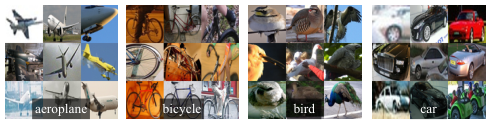

**重点**

- 读图时应观察：原本不同形状、尺度的区域已经变为统一输入大小，物体可能出现拉伸变形和上下文边缘。

**问题与解答**

- **问题：图中训练样本为什么外观可能不自然？**  
  因为它们已被 warp 到固定大小；CNN 训练和测试都接受同类变形，因此网络能够适应该输入分布。

## 2.2 Test-time detection

### 第 5 段：测试流程

**原文对照**

> At test time, we run selective search on the test image to extract around 2000 region proposals (we use selective search's "fast mode" in all experiments). We warp each proposal and forward propagate it through the CNN in order to compute features. Then, for each class, we score each extracted feature vector using the SVM trained for that class. Given all scored regions in an image, we apply a greedy non-maximum suppression (for each class independently) that rejects a region if it has an intersection-over-union (IoU) overlap with a higher scoring selected region larger than a learned threshold.

**译文**

在测试时，作者对测试图像运行 selective search，以提取约 2000 个区域候选；所有实验均使用 selective search 的 `fast mode`。随后 warp 每个 proposal，并将其前向传播通过 CNN 以计算特征。对于每个类别，作者使用为该类别训练的 SVM 给每一个提取出的特征向量评分。给定一幅图像中所有带评分的区域，作者对每个类别独立应用贪心非极大值抑制：如果某区域与一个分数更高且已被选中的区域之间的交并比（IoU）超过学习到的阈值，则拒绝该区域。

**重点**

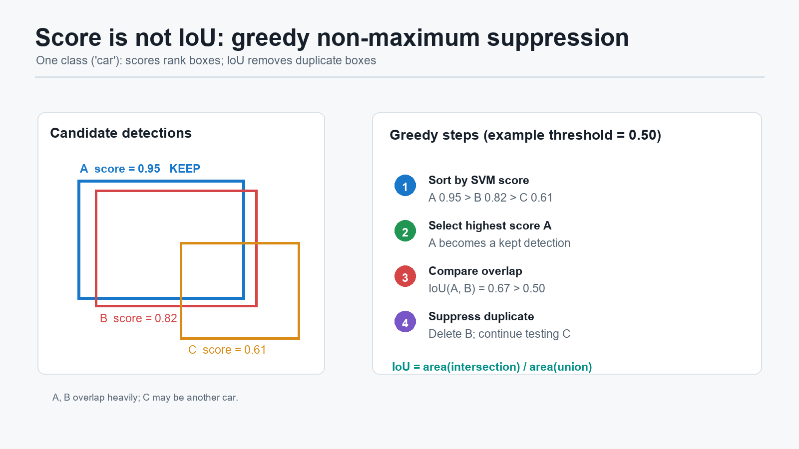

**问题与解答**

- **问题：什么叫 greedy NMS？**  
  针对同一类别，先保留最高分框，再删除与它 IoU 超过阈值的较低分重叠框；随后对剩余框重复。称“贪心”，是因为每一步都先接受当前最高分框。
- **问题：示例中的 `0.95` 是什么？**  
  是 SVM 检测分数，用于排序，不是 IoU。线性 SVM 输出也不天然限制在 `0` 到 `1`。
- **问题：IoU 是什么？**  
  对框 `A`、`B`：

  $$
  \operatorname{IoU}(A,B)=\frac{|A \cap B|}{|A \cup B|}
  $$

  它衡量两个框的重叠程度。
- **问题：NMS 为什么按类别独立？**  
  不同类别的真实物体可能互相重叠，例如人坐在自行车上；跨类别删除会误伤合理检测。

### 第 6 段：运行时间分析的两个优势

**原文对照**

> Run-time analysis. Two properties make detection efficient. First, all CNN parameters are shared across all categories. Second, the feature vectors computed by the CNN are low-dimensional when compared to other common approaches, such as spatial pyramids with bag-of-visual-word encodings. The features used in the UVA detection system [39], for example, are two orders of magnitude larger than ours (360k vs. 4k-dimensional).

**译文**

检测效率来自两个性质。第一，所有类别共享同一组 CNN 参数。第二，相比空间金字塔与词袋编码等常见方法，CNN 产生的特征向量维度低。以 UVA 检测系统为例，其特征比本文特征高两个数量级，即 `360k` 维对 `4k` 维。

**重点**

- 此处效率讨论重点是 **分类器随类别数扩展** 的成本。

**问题与解答**

- **问题：`360k` 维特征来自哪里？**  
  在随后 PASCAL 结果段落中，论文说明 UVA 对同样的 Selective Search 区域使用四层空间金字塔，并填入密集 SIFT、Extended OpponentSIFT 与 RGB-SIFT 的视觉词袋表示，因此区域特征非常高维。

### 第 7 段：哪些计算可以在类别之间共享

**原文对照**

> The result of such sharing is that the time spent computing region proposals and features (13s/image on a GPU or 53s/image on a CPU) is amortized over all classes. The only class-specific computations are dot products between features and SVM weights and non-maximum suppression. In practice, all dot products for an image are batched into a single matrix-matrix product. The feature matrix is typically 2000x4096 and the SVM weight matrix is 4096xN, where N is the number of classes.

**译文**

由于上述共享性质，计算区域候选和 CNN 特征所花的时间可以由所有类别共同承担：GPU 上约为每图 `13` 秒，CPU 上约为每图 `53` 秒。唯一针对具体类别的计算，是特征与 SVM 权重的点积以及非极大值抑制。在实践中，一幅图像的所有点积可组成一次矩阵乘法：特征矩阵通常为 `2000 x 4096`，SVM 权重矩阵为 `4096 x N`，其中 `N` 是类别数。

**重点**

- proposals 的 CNN 特征算完后，不必为每一个新类别重新提特征。
- 但每张图的 2000 个 proposal 仍各自经过 CNN，这是原始 R-CNN 的耗时核心。

**问题与解答**

- **问题：为何矩阵尺寸是 `2000 x 4096`？**  
  一行对应一个 proposal 的 4096 维特征，一幅测试图约含 2000 个 proposal。

### 第 8 段：可扩展到大量类别

**原文对照**

> This analysis shows that R-CNN can scale to thousands of object classes without resorting to approximate techniques, such as hashing. Even if there were 100k classes, the resulting matrix multiplication takes only 10 seconds on a modern multi-core CPU. This efficiency is not merely the result of using region proposals and shared features. The UVA system, due to its high-dimensional features, would be two orders of magnitude slower while requiring 134GB of memory just to store 100k linear predictors, compared to just 1.5GB for our lower-dimensional features.

**译文**

上述分析表明，R-CNN 可以扩展到数千个物体类别，而无需使用哈希等近似技术。即使有十万类别，最终矩阵乘法在现代多核 CPU 上也只需约 10 秒。这种效率不只是使用区域候选和共享特征的结果；由于 UVA 系统特征维度很高，它会慢两个数量级，而且仅存储十万个线性预测器就需要 `134GB` 内存，而 R-CNN 的低维特征只需 `1.5GB`。

**重点**

- 低维但高判别力的 CNN 表示同时改善精度和大类别系统的存储/计算规模。

**问题与解答**

- **问题：此段是否说明 R-CNN 已可实时运行？**  
  否。它说明加入大量类别的额外代价可控，不代表候选区域 CNN 特征抽取足够快。

### 第 9 段：与大规模 DPM 检测比较

**原文对照**

> It is also interesting to contrast R-CNN with the recent work from Dean et al. on scalable detection using DPMs and hashing [8]. They report a mAP of around 16% on VOC 2007 at a run-time of 5 minutes per image when introducing 10k distractor classes. With our approach, 10k detectors can run in about a minute on a CPU, and because no approximations are made mAP would remain at 59% (Section 3.2).

**译文**

作者还将 R-CNN 与 Dean 等人使用 DPM 与哈希实现的可扩展检测工作对比。后者在 VOC 2007 上加入一万个干扰类别时，约需每图 5 分钟并达到约 `16% mAP`。采用 R-CNN，一万个检测器在 CPU 上可约一分钟运行；由于不使用近似，mAP 将保持约 `59%`。

**重点**

- 论文主张 CNN 区域表示不仅准确，也适合比传统高维特征更大的类别集合。

**问题与解答**

- **问题：干扰类别是什么意思？**  
  在原检测类别外添加大量额外分类器，用来压力测试系统在大类别规模下的速度与精度稳定性。

## 2.3 Training

### 第 10 段：Supervised pre-training

**原文对照**

> Supervised pre-training. We discriminatively pre-trained the CNN on a large auxiliary dataset (ILSVRC2012 classification) using image-level annotations only (bounding-box labels are not available for this data). Pre-training was performed using the open source Caffe CNN library [24]. In brief, our CNN nearly matches the performance of Krizhevsky et al. [25], obtaining a top-1 error rate 2.2 percentage points higher on the ILSVRC2012 classification validation set. This discrepancy is due to simplifications in the training process.

**译文**

作者先在大型辅助数据集 ILSVRC2012 classification 上，以判别式方式预训练 CNN；这一阶段只使用图像级标注，因为该数据不提供边界框标签。预训练通过开源 Caffe CNN 库完成。简而言之，本文 CNN 的效果接近 Krizhevsky 等人的网络：在 ILSVRC2012 分类验证集上的 top-1 错误率高 `2.2` 个百分点，差异源于训练过程中的简化。

**重点**

- 预训练阶段学习的是整图分类，不使用 detection boxes。
- 这一步提供通用视觉特征初始化。

**问题与解答**

- **问题：没有边界框，如何训练后续要做检测的 CNN？**  
  先学习通用视觉表示；有边界框的 PASCAL proposals 会在下一阶段将网络适配到检测任务。

### 第 11 段：Domain-specific fine-tuning

**原文对照**

> Domain-specific fine-tuning. To adapt our CNN to the new task (detection) and the new domain (warped proposal windows), we continue stochastic gradient descent (SGD) training of the CNN parameters using only warped region proposals. Aside from replacing the CNN's ImageNet-specific 1000-way classification layer with a randomly initialized (N+1)-way classification layer (where N is the number of object classes, plus 1 for background), the CNN architecture is unchanged. For VOC, N = 20 and for ILSVRC2013, N = 200. We treat all region proposals with >= 0.5 IoU overlap with a ground-truth box as positives for that box's class and the rest as negatives. We start SGD at a learning rate of 0.001 (1/10th of the initial pre-training rate), which allows fine-tuning to make progress while not clobbering the initialization. In each SGD iteration, we uniformly sample 32 positive windows (over all classes) and 96 background windows to construct a mini-batch of size 128. We bias the sampling towards positive windows because they are extremely rare compared to background.

**译文**

为了使 CNN 适应新任务（检测）和新领域（warped proposal windows），作者只使用 warped region proposals，继续以 SGD 训练 CNN 参数。除将 ImageNet 专用的 1000 类分类层替换为随机初始化的 `(N+1)` 类分类层外，CNN 结构保持不变；其中 `N` 是物体类别数量，额外一类为背景。对于 VOC，`N=20`；对于 ILSVRC2013，`N=200`。凡与某个 ground-truth box 的 IoU 重叠不小于 `0.5` 的 region proposal，均被视为该真实框类别的正例，其余视为负例。SGD 初始学习率设为 `0.001`，为预训练初始学习率的十分之一，从而在推进 fine-tuning 的同时不破坏良好初始化。每次 SGD 迭代均匀采样 `32` 个正窗口和 `96` 个背景窗口，构成大小为 `128` 的 mini-batch；之所以偏向采样正窗口，是因为它们相比背景极其稀少。

**重点**

- `fine-tuning 标签` 的准确定义就在此段。
- `N+1` 的额外一类是 background。

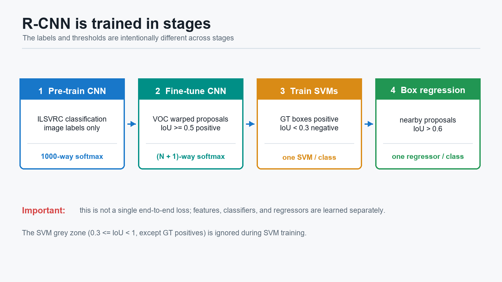

**问题与解答**

- **问题：Fine-tuning 标签是什么？**  
  对每个 proposal，找与它 IoU 最大的真实框；若最大 IoU `>= 0.5`，标签为该真实框类别，否则为背景。
- **问题：为什么不只用 ground-truth boxes 做正例？**  
  附录说明，允许 `IoU >= 0.5` 的抖动 proposals 作为正例可把正样本扩大约 30 倍，有助于微调整个高容量网络时减少过拟合。
- **问题：Fine-tuning 已经有分类层，为什么后面还要 SVM？**  
  作者实验证明直接使用 fine-tuned softmax 的检测结果弱于再训练 SVM；原因与更严格的正负例定义和 hard negatives 有关。

### 表 1 图注位置：VOC 2010 test 结果预告

**原文对照**

> Table 1: Detection average precision (%) on VOC 2010 test. R-CNN is most directly comparable to UVA and Regionlets since all methods use selective search region proposals. Bounding-box regression (BB) is described in Section C. At publication time, SegDPM was the top-performer on the PASCAL VOC leaderboard. DPM and SegDPM use context rescoring not used by the other methods.

**译文**

表 1 报告 VOC 2010 test 的 detection AP。R-CNN 与 UVA 和 Regionlets 的对比最直接，因为三者都使用 Selective Search 区域候选。边界框回归（BB）将在后文说明。论文发表时 SegDPM 是 PASCAL VOC 榜单上的最佳方法；DPM 与 SegDPM 使用了其他方法未使用的上下文重评分。

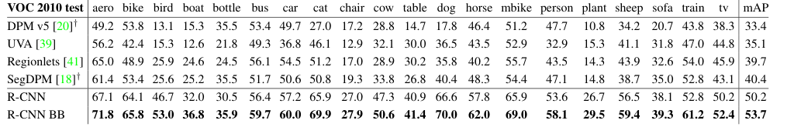

**重点**

| 方法 | mAP |
| --- | ---: |
| DPM v5 | 33.4 |
| UVA | 35.1 |
| Regionlets | 39.7 |
| SegDPM | 40.4 |
| R-CNN | 50.2 |
| R-CNN + BB | 53.7 |

**问题与解答**

- **问题：为什么表格在训练段落中出现，却在后面结果小节才解释？**  
  论文排版中表格是浮动对象；阅读逻辑上应在 `Results on PASCAL` 段结合实验设置理解。

### 第 12 段：Object category classifiers 的标签选择

**原文对照**

> Object category classifiers. Consider training a binary classifier to detect cars. It's clear that an image region tightly enclosing a car should be a positive example. Similarly, it's clear that a background region, which has nothing to do with cars, should be a negative example. Less clear is how to label a region that partially overlaps a car. We resolve this issue with an IoU overlap threshold, below which regions are defined as negatives. The overlap threshold, 0.3, was selected by a grid search over {0, 0.1, ..., 0.5} on a validation set. We found that selecting this threshold carefully is important. Setting it to 0.5, as in [39], decreased mAP by 5 points. Similarly, setting it to 0 decreased mAP by 4 points. Positive examples are defined simply to be the ground-truth bounding boxes for each class.

**译文**

考虑训练一个检测汽车的二分类器：紧紧包围汽车的图像区域显然应是正例，与汽车无关的背景区域显然应是负例；不明确的是，如何标记只部分覆盖汽车的区域。作者通过 IoU 阈值解决该问题：重叠低于阈值的区域被定义为负例。阈值 `0.3` 是在验证集上对 `{0, 0.1, ..., 0.5}` 进行网格搜索选出的。作者发现细致选择阈值很重要：将其设为 `0.5` 会使 mAP 降低 `5` 点，设为 `0` 会降低 `4` 点。每一类的正例则简单定义为该类的真实标注框。

**重点**

- 本段是 **SVM 标签规则**，不是上一段的 CNN fine-tuning 标签规则。

| 训练对象 | 正例 | 负例 |
| --- | --- | --- |
| CNN fine-tuning | proposals with `IoU >= 0.5` | 其余 proposals 为 background |
| Class-specific SVM | ground-truth boxes | 对该类 GT 的 `IoU < 0.3` proposals |

**问题与解答**

- **问题：IoU 在 `0.3` 到 `1.0` 之间且不是真实框的 proposal，SVM 怎么处理？**  
  论文附录明确说明这些 proposal 位于灰区，被忽略，不作为 SVM 正负样本。
- **问题：为什么 SVM 正例比 fine-tuning 正例严格？**  
  fine-tuning 需要扩大数据量来适配网络；最终 SVM 则希望把准确包围目标的区域与松散/错误区域分开。

### 第 13 段：训练每类 SVM 与 hard negative mining

**原文对照**

> Once features are extracted and training labels are applied, we optimize one linear SVM per class. Since the training data is too large to fit in memory, we adopt the standard hard negative mining method [17, 37]. Hard negative mining converges quickly and in practice mAP stops increasing after only a single pass over all images.

**译文**

在提取特征并赋予训练标签后，作者为每个类别优化一个线性 SVM。由于训练数据过大而无法放入内存，作者采用标准的 hard negative mining 方法。困难负例挖掘收敛很快；实践中，在所有图像上仅完成一轮扫描后，mAP 就不再提高。

**重点**

- SVM 的任务是最终检测评分。
- hard negatives 是当前模型最容易误判为某类目标的背景/错误区域。

**问题与解答**

- **问题：为什么不随机取大量背景就够了？**  
  大多数背景非常容易分类，真正决定分类边界的是那些看起来像目标、会被高分误检的困难负例。

### 第 14 段：为何标签不同、为何仍用 SVM

**原文对照**

> In Appendix B we discuss why the positive and negative examples are defined differently in fine-tuning versus SVM training. We also discuss the trade-offs involved in training detection SVMs rather than simply using the outputs from the final softmax layer of the fine-tuned CNN.

**译文**

作者在附录中讨论两个问题：为什么 CNN fine-tuning 与 SVM 训练对正负例采用不同定义；以及为什么要训练 detection SVM，而不是直接使用 fine-tuned CNN 最后 softmax 层的输出。

**重点**

- 这一段提示读者：R-CNN 训练不是端到端统一准则，而是经过实验选择的分阶段方案。

**问题与解答**

- **问题：论文对直接用 softmax 有何结果？**  
  附录报告：在 VOC 2007 上，直接用 21-way softmax 得到 `50.9% mAP`，而使用 SVM 为 `54.2% mAP`。

## 2.4 Results on PASCAL VOC 2010-12

### 第 15 段：实验协议

**原文对照**

> Following the PASCAL VOC best practices [15], we validated all design decisions and hyperparameters on the VOC 2007 dataset (Section 3.2). For final results on the VOC 2010-12 datasets, we fine-tuned the CNN on VOC 2012 train and optimized our detection SVMs on VOC 2012 trainval. We submitted test results to the evaluation server only once for each of the two major algorithm variants (with and without bounding-box regression).

**译文**

遵循 PASCAL VOC 的最佳实践，作者在 VOC 2007 数据集上验证所有设计选择和超参数。对于 VOC 2010-12 的最终结果，作者在 VOC 2012 train 上 fine-tune CNN，并在 VOC 2012 trainval 上优化 detection SVM。对于两个主要算法变体（有无边界框回归），作者分别只向测试评估服务器提交一次结果。

**重点**

- VOC 2007 用来做设计与消融，VOC 2010-12 用来报告最终泛化结果。
- 避免重复试测试集，是实验可信度的重要组成。

**问题与解答**

- **问题：为什么 fine-tune 用 train，而 SVM 用 trainval？**  
  这是作者最终评测协议的设置；SVM 基于固定特征训练，使用更多标注数据以训练最终分类器。

### 第 16 段：与传统区域检测系统的关键对比

**原文对照**

> Table 1 shows complete results on VOC 2010. We compare our method against four strong baselines, including SegDPM [18], which combines DPM detectors with the output of a semantic segmentation system [4] and uses additional inter-detector context and image-classifier rescoring. The most germane comparison is to the UVA system from Uijlings et al. [39], since our systems use the same region proposal algorithm. To classify regions, their method builds a four-level spatial pyramid and populates it with densely sampled SIFT, Extended OpponentSIFT, and RGB-SIFT descriptors, each vector quantized with 4000-word codebooks. Classification is performed with a histogram intersection kernel SVM. Compared to their multi-feature, non-linear kernel SVM approach, we achieve a large improvement in mAP, from 35.1% to 53.7% mAP, while also being much faster (Section 2.2). Our method achieves similar performance (53.3% mAP) on VOC 2011/12 test.

**译文**

表 1 给出 VOC 2010 完整结果。作者将方法与四个强基线比较，其中包括结合 DPM、语义分割输出、检测器间上下文与图像分类器重评分的 SegDPM。最有关联的比较对象是 Uijlings 等人的 UVA 系统，因为双方使用同样的 region proposal 算法。UVA 为区域构建四层空间金字塔，填入密集采样的 SIFT、Extended OpponentSIFT 和 RGB-SIFT 描述子；每种描述子使用 4000 词码本量化，并用 histogram intersection kernel SVM 分类。与这种多特征、非线性核 SVM 方法相比，R-CNN 将 mAP 从 `35.1%` 大幅提高至 `53.7%`，并且运行更快。R-CNN 在 VOC 2011/12 test 上获得相似的 `53.3% mAP`。

**重点**

- 相同 proposal 条件下，CNN 特征与传统区域特征的比较最能说明本文贡献。
- 此段也精确定义了前文 `360k` 区域特征比较对象的构造来源。

**问题与解答**

- **问题：`53.7%` 是否只来自 CNN？**  
  该数值包含 bounding-box regression。没有 BB 的 R-CNN 在 VOC 2010 表中为 `50.2%`；但两者都远高于 UVA。

## 2.5 Results on ILSVRC2013 detection

### 第 17 段：沿用 PASCAL 超参数

**原文对照**

> We ran R-CNN on the 200-class ILSVRC2013 detection dataset using the same system hyperparameters that we used for PASCAL VOC. We followed the same protocol of submitting test results to the ILSVRC2013 evaluation server only twice, once with and once without bounding-box regression.

**译文**

作者在包含 200 类的 ILSVRC2013 detection 数据集上运行 R-CNN，并使用与 PASCAL VOC 相同的系统超参数。他们继续遵守只向评估服务器提交两次测试结果的协议：一次不使用边界框回归，一次使用边界框回归。

**重点**

- 不为新的大规模测试任务专门反复调参，使跨数据集结果更有说服力。

**问题与解答**

- **问题：为何 200 类实验重要？**  
  它测试方法是否不仅适用于 VOC 的 20 类，也能扩展到更大的类别集合。

### 第 18 段：与 OverFeat 比较

**原文对照**

> Figure 3 compares R-CNN to the entries in the ILSVRC 2013 competition and to the post-competition OverFeat result [34]. R-CNN achieves a mAP of 31.4%, which is significantly ahead of the second-best result of 24.3% from OverFeat. To give a sense of the AP distribution over classes, box plots are also presented and a table of per-class APs follows at the end of the paper in Table 8. Most of the competing submissions (OverFeat, NEC-MU, UvA-Euvision, Toronto A, and UIUC-IFP) used convolutional neural networks, indicating that there is significant nuance in how CNNs can be applied to object detection, leading to greatly varying outcomes.

**译文**

图 3 将 R-CNN 与 ILSVRC 2013 竞赛提交方法以及赛后 OverFeat 结果作比较。R-CNN 达到 `31.4% mAP`，显著领先于 OverFeat 的 `24.3%`。作者还给出各类别 AP 分布的箱线图，并在文末列出每类 AP。多个竞争提交都采用 CNN，这表明：如何把 CNN 应用于目标检测存在重要细节，不同使用方式可产生差距很大的结果。

**重点**

- “用了 CNN”并不能保证检测成功；候选、训练和后处理设计都很关键。

**问题与解答**

- **问题：R-CNN 与 OverFeat 的核心范式差异是什么？**  
  R-CNN 以区域候选为定位入口；OverFeat 属于滑动窗口 CNN 检测路径。

### 第 19 段：更详细的数据集设置位置

**原文对照**

> In Section 4, we give an overview of the ILSVRC2013 detection dataset and provide details about choices that we made when running R-CNN on it.

**译文**

作者说明，关于 ILSVRC2013 detection 数据集概况及运行 R-CNN 时所做选择的细节，将在论文后续专节给出。

**重点**

- 本精读停在 `3.5`，此处只掌握该实验在主线中的作用：验证更大类别规模的检测性能。

**问题与解答**

- **问题：本段没有给新方法细节，为什么仍需阅读？**  
  它是行文中的指路段，明确主实验结论之外的数据与配置解释位于后文，避免把本节结果误当作无背景的孤立数字。

### 图 3 图注：ILSVRC2013 检测结果

**原文对照**

> Figure 3: (Left) Mean average precision on the ILSVRC2013 detection test set. Methods preceded by * use outside training data (images and labels from the ILSVRC classification dataset in all cases). (Right) Box plots for the 200 average precision values per method. A box plot for the post-competition OverFeat result is not shown because per-class APs are not yet available (per-class APs for R-CNN are in Table 8 and also included in the tech report source uploaded to arXiv.org; see R-CNN-ILSVRC2013-APs.txt). The red line marks the median AP, the box bottom and top are the 25th and 75th percentiles. The whiskers extend to the min and max AP of each method. Each AP is plotted as a green dot over the whiskers (best viewed digitally with zoom).

**译文**

左图显示 ILSVRC2013 detection test 上的 mean average precision；方法名前带星号者使用了额外训练数据，即 ILSVRC 分类数据中的图像与标签。右图显示每个方法 200 个类别 AP 值的箱线图。OverFeat 的赛后结果没有绘制箱线图，因为作者尚未获得其逐类 AP。箱线图中的红线表示 AP 中位数，箱体上下边界为第 25 和第 75 百分位，须延伸至最小与最大 AP，每个 AP 以绿色点显示。

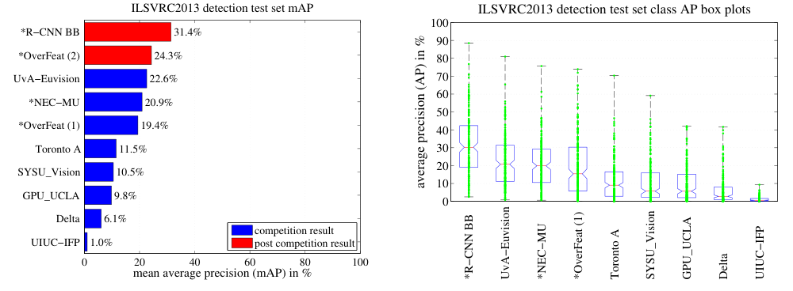

**重点**

- 总体 mAP 之外，逐类别 AP 分布能够显示方法是否只靠少数类别拉高平均值。

**问题与解答**

- **问题：为什么某些方法名前的星号重要？**  
  它标识使用了外部分类训练数据；比较检测性能时必须知道方法是否利用了额外监督来源。

---

# 3 Visualization, ablation, and modes of error

## 3.1 Visualizing learned features

### 第 1 段：为什么要看中间层

**原文对照**

> First-layer filters can be visualized directly and are easy to understand [25]. They capture oriented edges and opponent colors. Understanding the subsequent layers is more challenging. Zeiler and Fergus present a visually attractive deconvolutional approach in [42]. We propose a simple (and complementary) non-parametric method that directly shows what the network learned.

**译文**

第一层滤波器可以直接可视化并且容易理解：它们捕获有方向的边缘以及对立颜色。理解随后的层则更困难。Zeiler 与 Fergus 提出了一种具有视觉吸引力的反卷积方法；作者提出一种简单且互补的非参数方法，直接显示网络学到了什么。

**重点**

- 性能数字回答“有效吗”；可视化试图回答“学到了什么”。

**问题与解答**

- **问题：非参数可视化意味着什么？**  
  它不再训练一个解释模型，而是直接寻找能最大激活指定 unit 的实际候选区域。

### 第 2 段：把一个 unit 当探测器

**原文对照**

> The idea is to single out a particular unit (feature) in the network and use it as if it were an object detector in its own right. That is, we compute the unit's activations on a large set of held-out region proposals (about 10 million), sort the proposals from highest to lowest activation, perform non-maximum suppression, and then display the top-scoring regions. Our method lets the selected unit "speak for itself" by showing exactly which inputs it fires on. We avoid averaging in order to see different visual modes and gain insight into the invariances computed by the unit.

**译文**

该方法的想法是挑出网络中的某一个 unit（特征），将它当作一个独立物体探测器：在大量保留出的 region proposals（约一千万）上计算其激活，按激活从高到低排序，执行非极大值抑制，再展示最高分区域。这样，所选 unit 可以通过它实际响应的输入“自己说明自己”。作者避免求平均，以便看到不同视觉模式，并理解 unit 所计算出的不变性。

**重点**

- NMS 在这里不是最终检测流程，而是防止可视化样例全被近似重复区域占据。

**问题与解答**

- **问题：为什么不把最高激活区域平均起来？**  
  平均可能模糊不同响应模式，例如同一 unit 同时响应狗脸和点阵，单独样例更能显示多样性。

### 第 3 段：pool5 的维度与感受野

**原文对照**

> We visualize units from layer pool5, which is the max-pooled output of the network's fifth and final convolutional layer. The pool5 feature map is 6x6x256 = 9216-dimensional. Ignoring boundary effects, each pool5 unit has a receptive field of 195x195 pixels in the original 227x227 pixel input. A central pool5 unit has a nearly global view, while one near the edge has a smaller, clipped support.

**译文**

作者可视化的是 `pool5` 层的 unit；该层是网络第五个也是最后一个卷积层输出经过最大池化后的结果。`pool5` 特征图维度为 `6 x 6 x 256 = 9216`。忽略边界效应，每个 `pool5` unit 在原始 `227 x 227` 输入图像中的感受野为 `195 x 195` 像素。位于中心的 `pool5` unit 具有近乎全局的视野，而靠近边缘的 unit 支持区域较小且会被边界截断。

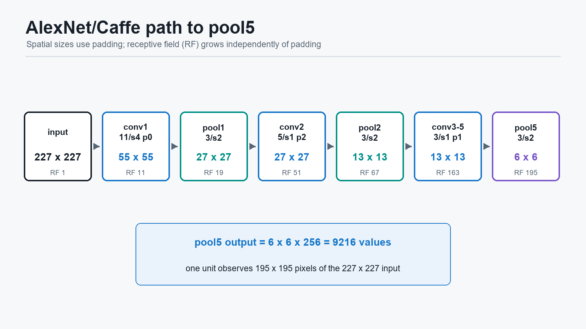

**重点**

- `pool5` 仍保留 `6 x 6` 的空间布局，又有很大的语义视野，适合做可视化。

**问题与解答**

- **问题：`pool5 = 6 x 6 x 256` 如何得到？**  
  使用 Caffe/AlexNet 路径的空间尺寸计算，关键在于 `conv2` 至 `conv5` 使用 padding：

  | 层 | Kernel / Stride / Padding | 输出空间尺寸 |
  | --- | --- | ---: |
  | input | - | 227 |
  | conv1 | `11 / 4 / 0` | 55 |
  | pool1 | `3 / 2 / 0` | 27 |
  | conv2 | `5 / 1 / 2` | 27 |
  | pool2 | `3 / 2 / 0` | 13 |
  | conv3 | `3 / 1 / 1` | 13 |
  | conv4 | `3 / 1 / 1` | 13 |
  | conv5 | `3 / 1 / 1` | 13 |
  | pool5 | `3 / 2 / 0` | 6 |

  `conv5` 有 256 个通道，所以输出为 `6 x 6 x 256`。
- **问题：`195 x 195` 感受野如何计算？**  
  使用递推：

  $$
  r_l=r_{l-1}+(k_l-1)j_{l-1},\qquad
  j_l=j_{l-1}s_l
  $$

  | 层 | 感受野 `r` | 有效步幅 `j` |
  | --- | ---: | ---: |
  | input | 1 | 1 |
  | conv1 | 11 | 4 |
  | pool1 | 19 | 8 |
  | conv2 | 51 | 8 |
  | pool2 | 67 | 16 |
  | conv3 | 99 | 16 |
  | conv4 | 131 | 16 |
  | conv5 | 163 | 16 |
  | pool5 | 195 | 32 |

### 第 4 段：可视化结果说明网络学到什么

**原文对照**

> Each row in Figure 4 displays the top 16 activations for a pool5 unit from a CNN that we fine-tuned on VOC 2007 trainval. Six of the 256 functionally unique units are visualized (Appendix D includes more). These units were selected to show a representative sample of what the network learns. In the second row, we see a unit that fires on dog faces and dot arrays. The unit corresponding to the third row is a red blob detector. There are also detectors for human faces and more abstract patterns such as text and triangular structures with windows. The network appears to learn a representation that combines a small number of class-tuned features together with a distributed representation of shape, texture, color, and material properties. The subsequent fully connected layer fc6 has the ability to model a large set of compositions of these rich features.

**译文**

图 4 的每一行显示一个 `pool5` unit 在经过 VOC 2007 trainval fine-tuning 的 CNN 上产生的最高 16 个激活区域。作者展示了 256 个功能不同 unit 中的六个，以代表网络学习到的模式。第二行可以看到一个会对狗脸和点阵列产生响应的 unit；第三行对应红色色块检测器；还有针对人脸以及文字、带窗三角结构等更抽象模式的探测器。网络似乎学到了一种混合表示：少量针对类别调整的特征，加上形状、纹理、颜色和材料属性的分布式表示。随后的全连接层 `fc6` 有能力为这些丰富特征的大量组合建模。

**重点**

- CNN 不只是记住类别名字，而是形成可组合的视觉属性与部件表示。

**问题与解答**

- **问题：一个 unit 同时响应狗脸和点阵，是否说明模型错误？**  
  不必然。一个中间特征可以响应共享纹理或局部结构，后续层再组合多个特征形成类别判断。

### 图 4 图注：六个 pool5 units

**原文对照**

> Figure 4: Top regions for six pool5 units. Receptive fields and activation values are drawn in white. Some units are aligned to concepts, such as people (row 1) or text (4). Other units capture texture and material properties, such as dot arrays (2) and specular reflections (6).

**译文**

图中展示六个 `pool5` unit 的最高响应区域，白色标出了感受野与激活值。部分 unit 与概念相对应，例如人物或文字；另一些捕捉纹理和材料性质，例如点阵排列和镜面反射。

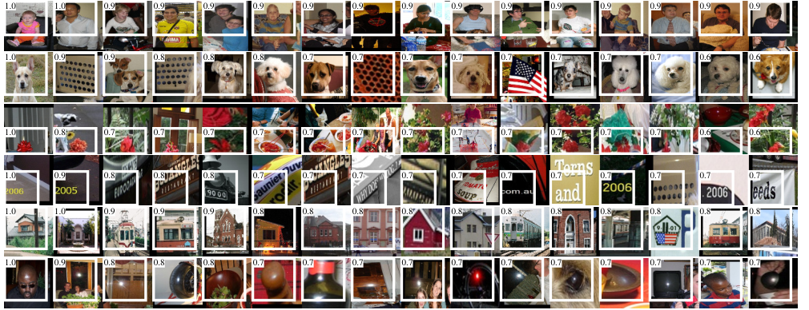

**重点**

- 该图支撑了“rich features”一词：深特征不仅有类别，也包含材质与纹理。

**问题与解答**

- **问题：这些图是否等于某个 SVM 检测器的输出？**  
  不是。它们按单个 `pool5` unit 激活排序，目的是解释中间特征，而不是报告最终类别检测。

### 表 2 表注：VOC 2007 上的检测 AP

**原文对照**

> Table 2: Detection average precision (%) on VOC 2007 test. Rows 1-3 show R-CNN performance without fine-tuning. Rows 4-6 show results for the CNN pre-trained on ILSVRC 2012 and then fine-tuned (FT) on VOC 2007 trainval. Row 7 includes a simple bounding-box regression (BB) stage that reduces localization errors (Section C). Rows 8-10 present DPM methods as a strong baseline. The first uses only HOG, while the next two use different feature learning approaches to augment or replace HOG.

**译文**

表 2 报告 VOC 2007 test 上的 detection average precision。第 1 到 3 行是没有 fine-tuning 的 R-CNN 表现；第 4 到 6 行是先在 ILSVRC 2012 上预训练，再在 VOC 2007 trainval 上 fine-tune 的结果；第 7 行加入简单边界框回归阶段以减少定位错误；第 8 到 10 行给出强 DPM 基线，其中第一种只使用 HOG，后两种以不同特征学习方法增强或替代 HOG。

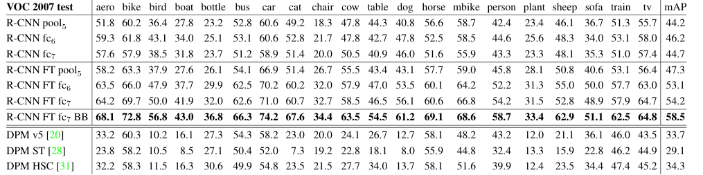

**重点**

- 该表是随后 `3.2 Ablation studies` 全部段落所解释的证据来源。
- 阅读顺序应是：先比较特征层，再比较 fine-tuning，再观察 BB 与 DPM 基线。

**问题与解答**

- **问题：为何同一表同时含消融和外部基线？**  
  内部消融说明 R-CNN 的性能来源，DPM 行则说明该性能相对当时主流检测器处于什么水平。

## 3.2 Ablation studies

### 第 5 段：未 fine-tune 时逐层分析的目的

**原文对照**

> Performance layer-by-layer, without fine-tuning. To understand which layers are critical for detection performance, we analyzed results on the VOC 2007 dataset for each of the CNN's last three layers. Layer pool5 was briefly described in Section 3.1. The final two layers are summarized below.

**译文**

为了理解哪些层对检测性能至关重要，作者在 VOC 2007 数据集上分析 CNN 最后三层的结果。`pool5` 已在 3.1 节简述；下面说明最后两个全连接层。

**重点**

- 消融分析通过替换读出的特征层，检验哪一层适于迁移到检测。

**问题与解答**

- **问题：此处删除层是否要重新训练 CNN？**  
  对未 fine-tune 分析而言，CNN 参数只来自 ILSVRC 预训练，作者用不同层特征训练/评估检测分类器以比较迁移能力。

### 第 6 段：fc6 的计算

**原文对照**

> Layer fc6 is fully connected to pool5. To compute features, it multiplies a 4096x9216 weight matrix by the pool5 feature map (reshaped as a 9216-dimensional vector) and then adds a vector of biases. This intermediate vector is component-wise half-wave rectified (x <- max(0,x)).

**译文**

`fc6` 与 `pool5` 完全连接。计算特征时，它用一个 `4096 x 9216` 的权重矩阵乘以展平为 9216 维向量的 `pool5` 特征图，再加偏置向量。得到的中间向量逐元素执行半波整流，即 `x <- max(0,x)`。

**重点**

- `fc6` 将保留空间结构的 pool5 响应组合成 4096 维表示。

**问题与解答**

- **问题：half-wave rectification 是什么？**  
  即 ReLU：将负数置为 0。

### 第 7 段：fc7 的计算

**原文对照**

> Layer fc7 is the final layer of the network. It is implemented by multiplying the features computed by fc6 by a 4096x4096 weight matrix, and similarly adding a vector of biases and applying half-wave rectification.

**译文**

`fc7` 是网络最后一个特征层。它用 `4096 x 4096` 权重矩阵乘以 `fc6` 计算出的特征，同样加上偏置并执行半波整流。

**重点**

- `fc7` 更靠近原始 ImageNet 分类输出，因此可能更受预训练分类任务特化影响。

**问题与解答**

- **问题：`fc7` 是否是最终类别概率层？**  
  不是。`fc7` 是 4096 维特征层；其后原分类网络还会有输出类别分数的层，R-CNN 则使用该特征训练 SVM。

### 第 8 段：没有 fine-tuning 的结果

**原文对照**

> We start by looking at results from the CNN without fine-tuning on PASCAL, i.e. all CNN parameters were pre-trained on ILSVRC 2012 only. Analyzing performance layer-by-layer (Table 2 rows 1-3) reveals that features from fc7 generalize worse than features from fc6. This means that 29%, or about 16.8 million, of the CNN's parameters can be removed without degrading mAP. More surprising is that removing both fc7 and fc6 produces quite good results even though pool5 features are computed using only 6% of the CNN's parameters. Much of the CNN's representational power comes from its convolutional layers, rather than from the much larger densely connected layers. This finding suggests potential utility in computing a dense feature map, in the sense of HOG, of an arbitrary-sized image by using only the convolutional layers of the CNN. This representation would enable experimentation with sliding-window detectors, including DPM, on top of pool5 features.

**译文**

作者首先观察没有在 PASCAL 上进行 fine-tuning 的 CNN，即全部 CNN 参数仅在 ILSVRC 2012 上预训练。逐层结果显示，`fc7` 特征的泛化性能比 `fc6` 更差。这意味着，删除约占 CNN 参数 `29%`、约 `1680` 万参数的 `fc7`，不会降低 mAP。更令人惊讶的是，同时去掉 `fc7` 和 `fc6` 后，仅用 `pool5` 特征仍取得不错结果，尽管计算 `pool5` 的卷积部分只占 CNN 参数的 `6%`。CNN 的大量表示能力来自卷积层，而不是参数规模更大的全连接层。这提示：可以仅用卷积层在任意尺寸图像上计算类似 HOG 的密集特征图，从而在 `pool5` 特征上尝试包括 DPM 在内的滑动窗口检测器。

**重点**

| 未 fine-tune 的表示 | VOC 2007 mAP |
| --- | ---: |
| `pool5` | 44.2 |
| `fc6` | 46.2 |
| `fc7` | 44.7 |

**问题与解答**

- **问题：为何 `fc7` 不如 `fc6`？**  
  作者由实验得出其迁移泛化更差；合理理解是 `fc7` 更接近 ImageNet 分类任务的专门表示，未适配检测时不如较早层通用。
- **问题：`pool5` 的维度为 9216，比 fc6 还高，为什么说卷积部分小？**  
  “只占 6%”说的是产生特征的可学习参数数量，不是输出向量维数。

### 第 9 段：Fine-tuning 后逐层性能

**原文对照**

> We now look at results from our CNN after having fine-tuned its parameters on VOC 2007 trainval. The improvement is striking (Table 2 rows 4-6): fine-tuning increases mAP by 8.0 percentage points to 54.2%. The boost from fine-tuning is much larger for fc6 and fc7 than for pool5, which suggests that the pool5 features learned from ImageNet are general and that most of the improvement is gained from learning domain-specific non-linear classifiers on top of them.

**译文**

作者接着考察在 VOC 2007 trainval 上 fine-tune 参数后的 CNN。改进十分明显：fine-tuning 将 mAP 提高 `8.0` 个百分点，达到 `54.2%`。`fc6` 和 `fc7` 的提升远大于 `pool5`，这表明从 ImageNet 学到的 `pool5` 特征较为通用，而大部分提升来自在它们上方学习领域特定的非线性分类器。

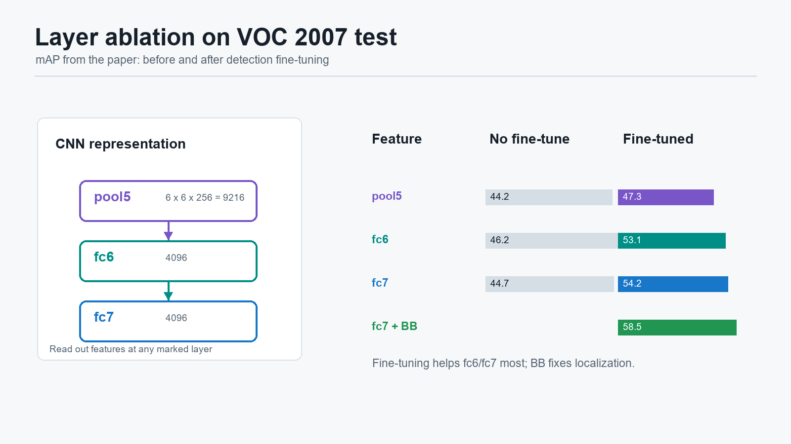

**重点**

| 表示 | 未 FT mAP | FT 后 mAP |
| --- | ---: | ---: |
| `pool5` | 44.2 | 47.3 |
| `fc6` | 46.2 | 53.1 |
| `fc7` | 44.7 | 54.2 |
| `fc7 + BB` | - | 58.5 |

**问题与解答**

- **问题：未 FT 时 fc7 较差，FT 后为何 fc7 最好？**  
  因为 fine-tuning 正是在把顶层表示从 ImageNet 分类领域重新适配到 PASCAL 检测领域。

### 第 10 段：比较近期特征学习方法的引入

**原文对照**

> Comparison to recent feature learning methods. Relatively few feature learning methods have been tried on PASCAL VOC detection. We look at two recent approaches that build on deformable part models. For reference, we also include results for the standard HOG-based DPM [20].

**译文**

在 PASCAL VOC 检测上尝试过的特征学习方法相对不多。作者考察两种建立在 deformable part model 之上的近期方法，并加入标准、基于 HOG 的 DPM 作为参考。

**重点**

- 接下来比较的目的不是只证明“R-CNN 比老 DPM 强”，而是与加入特征学习的 DPM 变体比较。

**问题与解答**

- **问题：为什么要比较学习型 DPM 变体？**  
  若只与纯 HOG 比较，提升可能被解释为“任何学习特征都有效”；与已有学习型特征比较能更强地检验深层 CNN 表示的优势。

### 第 11 段：DPM ST

**原文对照**

> The first DPM feature learning method, DPM ST [28], augments HOG features with histograms of "sketch token" probabilities. Intuitively, a sketch token is a tight distribution of contours passing through the center of an image patch. Sketch token probabilities are computed at each pixel by a random forest that was trained to classify 35x35 pixel patches into one of 150 sketch tokens or background.

**译文**

第一种 DPM 特征学习方法 DPM ST，在 HOG 特征上加入“sketch token”概率的直方图。直观而言，一个 sketch token 表示穿过图像 patch 中心的一类紧密轮廓分布。每个像素处的 sketch token 概率由随机森林计算；该随机森林训练用于将 `35 x 35` 像素 patch 分入 150 种 sketch tokens 之一或背景。

**重点**

- DPM ST 是在传统检测框架中加入学习所得轮廓信息的尝试。

**问题与解答**

- **问题：DPM ST 是否使用与 R-CNN 一样的深层网络？**  
  不是。它仍在 DPM 体系中，以学习出的 sketch-token 轮廓概率增强 HOG 表示。

### 第 12 段：DPM HSC

**原文对照**

> The second method, DPM HSC [31], replaces HOG with histograms of sparse codes (HSC). To compute an HSC, sparse code activations are solved for at each pixel using a learned dictionary of 100 7x7 pixel (grayscale) atoms. The resulting activations are rectified in three ways (full and both half-waves), spatially pooled, unit l2 normalized, and then power transformed (x <- sign(x)|x|^a).

**译文**

第二种方法 DPM HSC 使用稀疏编码直方图（HSC）替代 HOG。为了计算 HSC，它在每个像素处利用由 100 个 `7 x 7` 灰度原子组成的学习字典求稀疏编码激活；再以三种方式整流这些激活，进行空间池化、单位 `l2` 归一化，并执行幂变换。

**重点**

- 作者给出细节，是为了说明比较对象也不是简单手工基线，而是已有特征学习增强方案。

**问题与解答**

- **问题：DPM HSC 与 R-CNN 的共同点和差异是什么？**  
  共同点是都引入学习得到的特征；差异是 HSC 基于局部稀疏编码直方图，R-CNN 使用深层卷积层次表示。

### 第 13 段：R-CNN 对这些方法的优势

**原文对照**

> All R-CNN variants strongly outperform the three DPM baselines (Table 2 rows 8-10), including the two that use feature learning. Compared to the latest version of DPM, which uses only HOG features, our mAP is more than 20 percentage points higher: 54.2% vs. 33.7%—a 61% relative improvement. The combination of HOG and sketch tokens yields 2.5 mAP points over HOG alone, while HSC improves over HOG by 4 mAP points (when compared internally to their private DPM baselines—both use non-public implementations of DPM that underperform the open source version [20]). These methods achieve mAPs of 29.1% and 34.3%, respectively.

**译文**

所有 R-CNN 变体都显著超过三个 DPM 基线，包括使用特征学习的两个版本。与只使用 HOG 特征的最新版 DPM 相比，R-CNN 的 mAP 高出 20 多个百分点：`54.2%` 对 `33.7%`，即 `61%` 的相对提高。HOG 与 sketch tokens 的结合相对于 HOG 单独使用提高 `2.5` 个 mAP 点；HSC 相对于其内部 HOG 基线提高 `4` 点。两种方法分别得到 `29.1%` 与 `34.3% mAP`。

**重点**

- 深层 CNN 表示带来的提升远大于当时在 DPM 内增添学习型浅层特征的提升。

**问题与解答**

- **问题：为什么本段用 `54.2%` 而不是含回归的 `58.5%` 比 DPM？**  
  这里比较重点是特征表示/分类能力；即使不依赖 BB 回归，fine-tuned R-CNN 也已大幅领先。

## 3.3 Network architectures

### 第 14 段：更深网络的效果

**原文对照**

> Most results in this paper use the network architecture from Krizhevsky et al. [25]. However, we have found that the choice of architecture has a large effect on R-CNN detection performance. In Table 3 we show results on VOC 2007 test using the 16-layer deep network recently proposed by Simonyan and Zisserman [43]. This network was one of the top performers in the recent ILSVRC 2014 classification challenge. The network has a homogeneous structure consisting of 13 layers of 3x3 convolution kernels, with five max pooling layers interspersed, and topped with three fully-connected layers. We refer to this network as "O-Net" for OxfordNet and the baseline as "T-Net" for TorontoNet.

**译文**

论文大多数结果采用 Krizhevsky 等人的网络结构。但作者发现，网络架构的选择会显著影响 R-CNN 检测性能。在 VOC 2007 test 上，作者测试了 Simonyan 与 Zisserman 新提出的 16 层深网络；该网络是 ILSVRC 2014 分类挑战的领先模型之一，具有同质结构：13 个 `3 x 3` 卷积层，中间穿插五个最大池化层，顶部有三个全连接层。作者将它称为 `O-Net`（OxfordNet），将基线网络称为 `T-Net`（TorontoNet）。

**重点**

- R-CNN 是检测框架；CNN backbone 可替换，更强 backbone 可提高性能。

**问题与解答**

- **问题：本段是否意味着论文主体方法必须使用 VGG-16？**  
  不是。主体结果多基于 T-Net；O-Net 实验说明同一 R-CNN 框架可从更强 backbone 中受益。

### 第 15 段：O-Net 如何放入 R-CNN

**原文对照**

> To use O-Net in R-CNN, we downloaded the publicly available pre-trained network weights for the VGG ILSVRC 16 layers model from the Caffe Model Zoo. We then fine-tuned the network using the same protocol as we used for T-Net. The only difference was to use smaller minibatches (24 examples) as required in order to fit within GPU memory. The results in Table 3 show that R-CNN with O-Net substantially outperforms R-CNN with T-Net, increasing mAP from 58.5% to 66.0%. However there is a considerable drawback in terms of compute time, with the forward pass of O-Net taking roughly 7 times longer than T-Net.

**译文**

为了在 R-CNN 中使用 O-Net，作者从 Caffe Model Zoo 下载公开提供的 `VGG_ILSVRC_16_layers` 预训练网络权重，然后使用与 T-Net 相同的协议进行 fine-tuning。唯一差异是，为适应 GPU 显存，O-Net 使用较小的 mini-batch（24 个样本）。结果表明，使用 O-Net 的 R-CNN 显著优于使用 T-Net 的 R-CNN，mAP 从 `58.5%` 提高至 `66.0%`。代价是计算时间明显增加：O-Net 前向传播耗时约为 T-Net 的 `7` 倍。

**重点**

| 模型 | 含 BB mAP |
| --- | ---: |
| R-CNN T-Net BB | 58.5 |
| R-CNN O-Net BB | 66.0 |

**问题与解答**

- **问题：性能提升来自 R-CNN 流程改变了吗？**  
  没有；proposal、fine-tuning、SVM 与 BB 流程相同，主要变化是 backbone 更强。
- **问题：为何这也暴露 R-CNN 的缺点？**  
  R-CNN 对每个 proposal 单独跑网络；backbone 越慢，重复前向计算代价越严重。

### 表 3 表注：两种 CNN 架构

**原文对照**

> Table 3: Detection average precision (%) on VOC 2007 test for two different CNN architectures. The first two rows are results from Table 2 using Krizhevsky et al.'s architecture (T-Net). Rows three and four use the recently proposed 16-layer architecture from Simonyan and Zisserman (O-Net) [43].

**译文**

表 3 报告两种 CNN 架构在 VOC 2007 test 上的 detection AP。前两行来自使用 Krizhevsky 等人结构（T-Net）的结果；第三、四行使用 Simonyan 与 Zisserman 的 16 层架构（O-Net）。

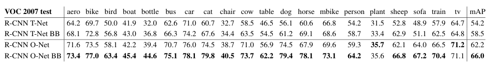

**重点**

| 系统 | mAP |
| --- | ---: |
| R-CNN T-Net | 54.2 |
| R-CNN T-Net BB | 58.5 |
| R-CNN O-Net | 62.2 |
| R-CNN O-Net BB | 66.0 |

**问题与解答**

- **问题：表注本身希望读者看出的最主要比较是什么？**  
  在相同 R-CNN 框架下，`O-Net BB` 相比 `T-Net BB` 从 `58.5` 提高到 `66.0`，说明 backbone 选择影响巨大。

## 3.4 Detection error analysis

### 第 16 段：为什么做错误分析

**原文对照**

> We applied the excellent detection analysis tool from Hoiem et al. [23] in order to reveal our method's error modes, understand how fine-tuning changes them, and to see how our error types compare with DPM. A full summary of the analysis tool is beyond the scope of this paper and we encourage readers to consult [23] to understand some finer details (such as "normalized AP"). Since the analysis is best absorbed in the context of the associated plots, we present the discussion within the captions of Figure 5 and Figure 6.

**译文**

作者使用 Hoiem 等人的优秀检测分析工具，以揭示方法的错误模式、理解 fine-tuning 如何改变这些错误，并观察 R-CNN 与 DPM 的错误类型差异。论文不完整复述该分析工具，而建议读者查阅原工作以理解“normalized AP”等细节。由于分析需要结合相应图表吸收，作者将讨论内容放入图 5 与图 6 的图注中。

**重点**

- 错误分析要回答的是：下一步优化应该优先改善分类混淆、背景误检，还是定位？

**问题与解答**

- **问题：为什么 mAP 数字不足以指导改进？**  
  mAP 只告诉总体结果高低，不能告诉性能损失是来自框位置、类别混淆还是背景误检；不同错误需要不同技术方案。

### 图 5 图注：高分 false positives 的类型分布

**原文对照**

> Figure 5: Distribution of top-ranked false positive (FP) types. Each plot shows the evolving distribution of FP types as more FPs are considered in order of decreasing score. Each FP is categorized into 1 of 4 types: Loc—poor localization (a detection with an IoU overlap with the correct class between 0.1 and 0.5, or a duplicate); Sim—confusion with a similar category; Oth—confusion with a dissimilar object category; BG—a FP that fired on background. Compared with DPM (see [23]), significantly more of our errors result from poor localization, rather than confusion with background or other object classes, indicating that the CNN features are much more discriminative than HOG. Loose localization likely results from our use of bottom-up region proposals and the positional invariance learned from pre-training the CNN for whole-image classification. Column three shows how our simple bounding-box regression method fixes many localization errors.

**译文**

图 5 中每幅图显示：随着按分数从高到低纳入更多 false positives，各类错误所占比例如何变化。每个 false positive 被分为四种类型之一：`Loc` 表示定位不佳，即与正确类别真实框的 IoU 位于 `0.1` 到 `0.5` 之间，或属于重复检测；`Sim` 表示与相似类别混淆；`Oth` 表示与不相似物体类别混淆；`BG` 表示在背景上触发的 false positive。与 DPM 相比，R-CNN 显著更多错误来自定位不佳，而不是与背景或其他类别混淆，这说明 CNN 特征比 HOG 更具判别力。定位偏松可能来自自底向上的 region proposals，以及 CNN 为整图分类预训练时学到的位置不变性。图中第三列显示，简单的边界框回归方法修复了许多定位错误。

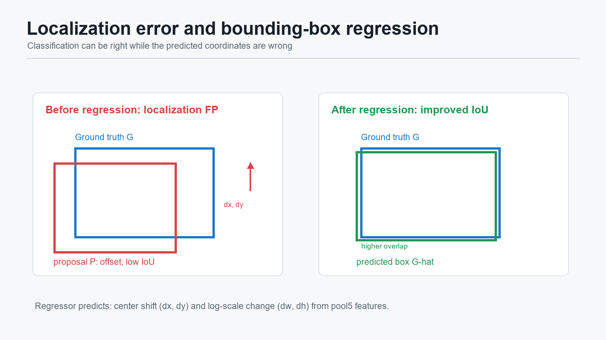

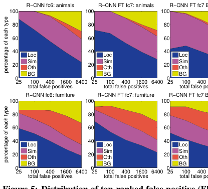

**重点**

- “更多定位错误”并不等于 R-CNN 更差；它表示类别/背景判别已经明显改善，剩余主要瓶颈转向定位。

**问题与解答**

- **问题：类别正确但 IoU 在 `0.1` 到 `0.5` 之间，为什么算 false positive？**  
  检测不仅要识别类别，还要求框与目标充分重叠；VOC 正确检测通常要求 IoU 至少为 `0.5`。
- **问题：为什么分类预训练可能导致定位松？**  
  图像分类重视“是否出现某物体”，常鼓励对精确位置变化不敏感；检测则需要框边界精确。

### 图 6 图注：对目标属性的敏感性

**原文对照**

> Figure 6: Sensitivity to object characteristics. Each plot shows the mean (over classes) normalized AP (see [23]) for the highest and lowest performing subsets within six different object characteristics (occlusion, truncation, bounding-box area, aspect ratio, viewpoint, part visibility). We show plots for our method (R-CNN) with and without fine-tuning (FT) and bounding-box regression (BB) as well as for DPM voc-release5. Overall, fine-tuning does not reduce sensitivity (the difference between max and min), but does substantially improve both the highest and lowest performing subsets for nearly all characteristics. This indicates that fine-tuning does more than simply improve the lowest performing subsets for aspect ratio and bounding-box area, as one might conjecture based on how we warp network inputs. Instead, fine-tuning improves robustness for all characteristics including occlusion, truncation, viewpoint, and part visibility.

**译文**

图 6 每幅图显示：对于六种物体属性（遮挡、截断、边界框面积、宽高比、视角和部件可见性），性能最好与最差子集上的类别平均 normalized AP。图中展示 R-CNN 在无 fine-tuning、有 fine-tuning、有 fine-tuning 加 bounding-box regression 时的结果，以及 DPM 的结果。总体来看，fine-tuning 并没有减少对这些属性的敏感程度（最好与最差子集之间的差距），但在几乎所有属性上同时显著改善了高表现和低表现子集。这说明 fine-tuning 不只是改善了由于 warp 可能引发的宽高比或框面积困难，而是对遮挡、截断、视角和部件可见性等多种特性都提高了鲁棒性。

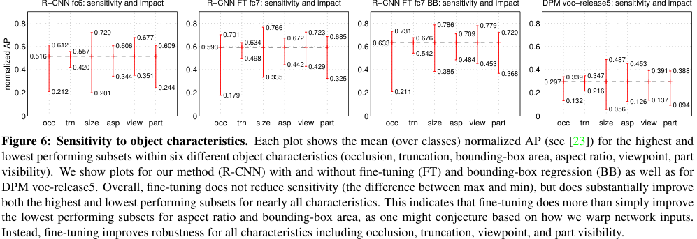

**重点**

- Fine-tuning 带来的提升具有广泛性，不可简单归结为纠正 warp 形变。

**问题与解答**

- **问题：fine-tuning 后仍对困难属性敏感，是否意味着无效？**  
  不是。它整体提高了各类子集表现，但没有完全消除困难条件与容易条件之间的差距。

## 3.5 Bounding-box regression

### 第 17 段：由错误分析引出的改进

**原文对照**

> Based on the error analysis, we implemented a simple method to reduce localization errors. Inspired by the bounding-box regression employed in DPM [17], we train a linear regression model to predict a new detection window given the pool5 features for a selective search region proposal. Full details are given in Appendix C. Results in Table 1, Table 2, and Figure 5 show that this simple approach fixes a large number of mislocalized detections, boosting mAP by 3 to 4 points.

**译文**

基于错误分析，作者实现了一种简单方法以减少定位错误。受 DPM 中边界框回归启发，作者训练一个线性回归模型：给定某个 selective search region proposal 的 `pool5` 特征，预测一个新的检测窗口。完整细节在附录中给出。VOC 2010、VOC 2007 表格以及错误类型图均表明，这种简单方法修复了大量错误定位检测，使 mAP 提升 `3` 到 `4` 个百分点。

**重点**

- 回归器输入是 proposal 的 `pool5` CNN 特征。
- 回归器输出是更准确的新框，而不是类别。
- 本段完成逻辑闭环：`发现定位错误占主导 -> 用回归修正位置 -> mAP 上升`。

**问题与解答**

- **问题：Bounding-box regression 是否替代 Selective Search？**  
  不替代。它基于已有 proposal 预测更贴近真实物体的新窗口。
- **问题：为什么回归器适合处理定位错误，而不是背景误检？**  
  回归能调整已经接近目标的框；对于本来不含目标的背景区域，没有合理的“移动到某物体”的监督任务。

### 由主文指向附录的必要细节：回归参数化

本小节主文只概述方法并指向附录。为了回答“回归器到底学什么”，下面保持论文附录中的定义，不改变主文段落顺序。

对 proposal 框：

$$
P=(P_x,P_y,P_w,P_h)
$$

以及对应 ground-truth 框：

$$
G=(G_x,G_y,G_w,G_h)
$$

其中 `x,y` 为中心坐标，`w,h` 为宽高。回归目标是：

$$
t_x=(G_x-P_x)/P_w,\qquad t_y=(G_y-P_y)/P_h
$$

$$
t_w=\log(G_w/P_w),\qquad t_h=\log(G_h/P_h)
$$

模型以 `pool5` 特征 $\phi_5(P)$ 预测四个偏移：

$$
d_\star(P)=w_\star^T\phi_5(P),\qquad \star\in\{x,y,w,h\}
$$

测试时将 proposal 修正为：

$$
\hat{G}_x=P_wd_x(P)+P_x,\qquad
\hat{G}_y=P_hd_y(P)+P_y
$$

$$
\hat{G}_w=P_w\exp(d_w(P)),\qquad
\hat{G}_h=P_h\exp(d_h(P))
$$

论文附录还说明：

- 使用 ridge regression，验证集选择正则化参数 `lambda = 1000`。
- 只使用与某 ground-truth box 的最大 `IoU > 0.6` 的 proposals 训练回归器。
- 每个类别训练自己的回归器。
- 测试时只预测一次新窗口；迭代重复修正没有进一步改善结果。

**重点**

- 回归目标使用相对位移和对数尺度变化，使不同大小 proposal 共用可学习的线性修正规则。
- `IoU > 0.6` 限制保证回归任务是“精修接近目标的框”，而不是从任意区域寻找目标。

**问题与解答**

- **问题：为什么中心偏移除以 `P_w`、`P_h`？**  
  使平移成为相对尺度变化：移动 10 像素对于小框和大框的意义不同。
- **问题：为什么宽高使用对数比例？**  
  尺度变化以乘法发生，对数将其变成适合线性预测的加性目标，并确保还原后的宽高为正。
- **问题：`IoU > 0.6` 与 fine-tuning 的 `IoU >= 0.5`、SVM 的 `< 0.3` 是一回事吗？**  
  不是。它们分别服务于：学习检测域表示、学习严格分类边界、学习精确位置修正。

---

# 3.6 Qualitative results

### 第 18 段：ILSVRC2013 定性检测结果

**原文对照**

> Qualitative detection results on ILSVRC2013 are presented in Figure 8 and Figure 9 at the end of the paper. Each image was sampled randomly from the val2 set and all detections from all detectors with a precision greater than 0.5 are shown. Note that these are not curated and give a realistic impression of the detectors in action.

作者把 ILSVRC2013 的定性检测结果放在文末图 8、图 9、图 10 和图 11 中。其中图 8、图 9 是从 `val2` 随机采样的图片，显示所有 precision 大于 `0.5` 的检测；图 10、图 11 是作者挑选的有趣、惊讶或好玩的例子。

**译文**

作者在文末展示 ILSVRC2013 上的定性检测结果。图 8 和图 9 中的图片是从 `val2` 随机抽取的，并展示所有 precision 高于 `0.5` 的检测，因此它们更接近真实运行时的效果，而不是刻意挑选的最好案例。图 10 和图 11 则是作者主动挑选的例子，因为这些图片中的结果比较有趣、出人意料或具有展示性；同样只显示 precision 大于 `0.5` 的检测。

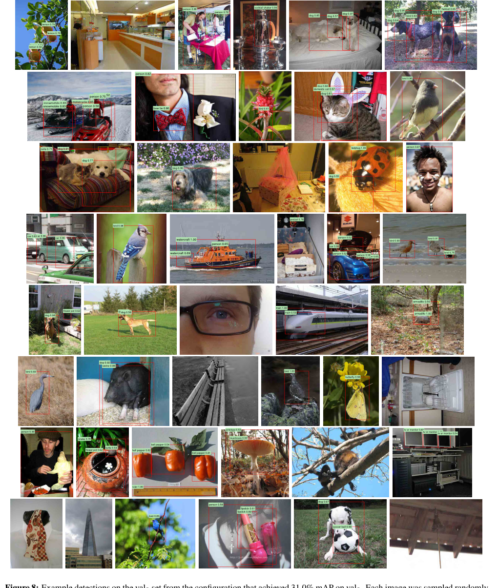

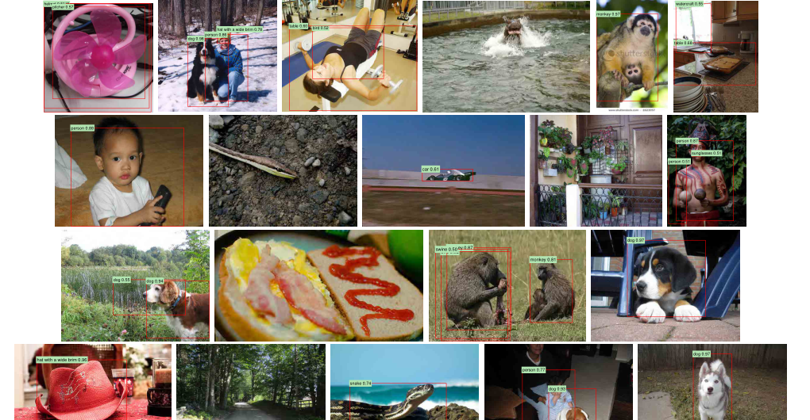

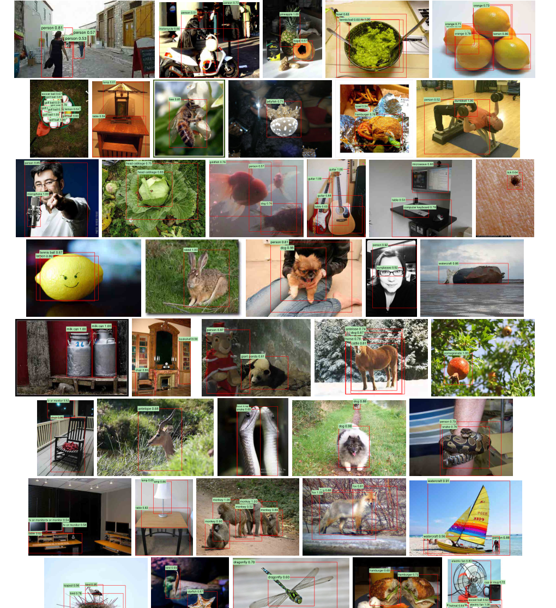

**重点**

- 随机样例用于展示系统的真实表现，精选样例用于展示模型能力边界与有趣现象。
- `precision > 0.5` 不是检测框置信度阈值本身，而是来自该类别检测器 precision-recall 曲线上的 precision 值。

**问题与解答**

- **问题：为什么论文要展示随机样例和精选样例两类图？**  
  随机样例防止只看漂亮结果；精选样例帮助读者直观看到模型在复杂场景、多目标、小物体或新奇类别上的能力。
- **问题：这些图对算法结论有决定性作用吗？**  
  没有。主结论来自 mAP、消融实验和错误分析；定性图主要帮助建立直觉。

---

# 4 The ILSVRC2013 Detection Dataset

### 第 1 段：为什么需要单独讨论 ILSVRC2013

**原文对照**

> In Section 2 we presented results on the ILSVRC2013 detection dataset. This dataset is less homogeneous than PASCAL VOC, requiring choices about how to use it. Since these decisions are non-trivial, we cover them in this section.

第 2 节已经报告 ILSVRC2013 检测结果，但该数据集比 PASCAL VOC 更不均一，数据使用方式不是显然的，因此作者单独解释数据划分、训练策略和验证方式。

**译文**

作者在第 2 节已经给出 ILSVRC2013 检测数据集上的结果。由于这个数据集不像 PASCAL VOC 那样同质，训练集、验证集、测试集的来源和标注方式都不同，如何使用这些数据会影响实验设计。因此第 4 节专门说明作者对 ILSVRC2013 的数据处理选择。

**重点**

- 第 4 节不是新算法，而是解释大规模检测实验的协议。
- ILSVRC2013 的难点在于：训练集大但标注不完整，验证/测试集标注完整但数量少。

## 4.1 Dataset overview

### 第 2 段：ILSVRC2013 的三个 split

**原文对照**

> The ILSVRC2013 detection dataset is split into three sets: train (395,918), val (20,121), and test (40,152), where the number of images in each set is in parentheses.

> The val and test splits are exhaustively annotated, meaning that in each image all instances from all 200 classes are labeled with bounding boxes. The train set, in contrast, is drawn from the ILSVRC2013 classification image distribution.

ILSVRC2013 detection 分为 `train`、`val`、`test`。`val/test` 来自相同的场景图像分布，且 200 类实例被完整标注；`train` 来自分类数据分布，更多是单个居中物体，且检测框标注不完整。额外的每类 negative images 没有被本文使用。

**译文**

ILSVRC2013 检测数据集包含三个集合：`train` 有 `395,918` 张图，`val` 有 `20,121` 张图，`test` 有 `40,152` 张图。`val` 和 `test` 来自相同图像分布，图像像真实场景，复杂度接近 PASCAL VOC，并且所有 200 个类别的实例都被完整标注了边界框。相反，`train` 来自 ILSVRC 分类数据分布，图像复杂度变化更大，而且倾向于单个居中物体；由于数量很大，`train` 没有进行穷尽式检测标注。也就是说，一张 `train` 图里可能有某个 200 类物体，但它未必被标出来。数据集还为每个类别提供额外负样本图像，并人工确认这些图不含对应类别实例，但本文没有使用这些 negative image sets。

**重点**

- `val/test` 适合检测评估，因为标注完整。
- `train` 可以补充正样本，但不能安全地当作负样本来源。

### 第 3 段：这些 split 带来的训练选择

**原文对照**

> The train images cannot be used for hard negative mining, because annotations are not exhaustive. Where should negative examples come from? Also, the train images have different statistics than val and test.

由于 `train` 标注不完整，不能用于 hard negative mining；同时 `train` 与 `val/test` 分布不同，是否使用以及如何使用都需要选择。作者没有穷举所有方案，而是采用基于经验的直接策略。

**译文**

这些数据划分给 R-CNN 训练带来几个选择：`train` 图像不能用于 hard negative mining，因为未标出的物体可能被误当成负例；那么负样本应从哪里来？此外，`train` 图像分布与 `val/test` 不同，它们是否应该被使用，如果使用又该使用多少？作者没有系统评估所有可能方案，而是给出他们认为基于经验最自然的一条路径。

**重点**

- 标注不完整时，最危险的是把“漏标物体”当成负样本。
- 这正是你前面问“我们的项目怎么处理数据集”时的核心差异：VOC 标注完整得多，所以可以直接从低 IoU proposal 取负样本。

### 第 4 段：把 val 拆成 val1 / val2

**原文对照**

> Our general strategy is to rely heavily on the val set and use some of the train images as an auxiliary source of positive examples. To use val for both training and validation, we split it into roughly equally sized “val1” and “val2” sets.

作者主要依赖 `val`，并把 `train` 作为辅助正样本来源。为了同时用 `val` 训练和验证，作者把 `val` 类均衡地拆成 `val1` 和 `val2`。由于一些类别样本很少，拆分时要控制类别不平衡。

**译文**

作者的总体策略是重度依赖 `val`，并使用部分 `train` 图像作为额外正样本来源。为了让 `val` 同时承担训练和验证功能，他们把它分成大致等大的 `val1` 和 `val2`。由于某些类别在 `val` 中样本非常少，最少的类别只有 31 个实例，一半类别少于 110 个实例，所以拆分必须尽量保持类别均衡。作者生成大量候选划分，并选择最大相对类别不平衡最小的划分；最终划分最大相对不平衡约 `11%`，中位相对不平衡约 `4%`。

**重点**

- `val1` 用来训练部分模块和挖负样本。
- `val2` 用来验证数据使用策略和消融实验。

**问题与解答**

- **问题：为什么不直接用原始 train 训练全部模块？**  
  因为 `train` 标注不完整，漏标目标会污染负样本和 hard negative mining。
- **问题：为什么 val1/val2 要类均衡？**  
  200 类检测中很多类别样本少，如果随机拆分，某些类别可能在一半数据里几乎消失，AP 估计会非常不稳定。

## 4.2 Region proposals

### 第 5 段：ILSVRC 上的 Selective Search

**原文对照**

> Selective search was run in “fast mode” on each image in val1, val2, and test (but not on images in train).

> On val, selective search resulted in an average of 2403 region proposals per image with a 91.6% recall of all ground-truth bounding boxes.

作者沿用 PASCAL 的 proposal 方法，在 `val1`、`val2`、`test` 上运行 fast mode Selective Search，不在 `train` 上运行。由于 Selective Search 对尺度不变性不足，作者先把每张图缩放到固定宽度 `500` 像素。平均每张图产生 `2403` 个 proposals，IoU 0.5 下召回率 `91.6%`，低于 PASCAL 的约 `98%`。

**译文**

ILSVRC 实验继续使用 PASCAL 中的区域候选方法：对 `val1`、`val2` 和 `test` 中每张图运行 fast mode Selective Search，但不对 `train` 图像运行。因为 Selective Search 不是尺度不变的，不同分辨率会产生不同数量的候选区域，而 ILSVRC 图像大小差异很大，所以作者先把每张图缩放到固定宽度 `500` 像素，再生成候选框。在 `val` 上，平均每张图有 `2403` 个 region proposals，在 `0.5 IoU` 阈值下对真实框的召回率是 `91.6%`。这个召回率明显低于 PASCAL 上约 `98%` 的召回率，说明 proposal 阶段仍有很大改进空间。

**重点**

- ILSVRC 结果受 proposal 召回率限制更明显。
- 不在 `train` 上跑 Selective Search，是因为 `train` 主要只用 ground-truth boxes 补正样本。

## 4.3 Training data

### 第 6 段：构造 val1 + trainN

**原文对照**

> For training data, we formed a set of images and boxes that includes all selective search and ground-truth boxes from val1 together with up to N ground-truth boxes per class from train.

训练集合包含 `val1` 的所有 Selective Search boxes 和 ground-truth boxes，再加上 `train` 中每类最多 `N` 个 ground-truth boxes，记为 `val1+trainN`。消融实验考察 `N=0,500,1000`。

**译文**

作者构造训练数据时，把 `val1` 中所有 Selective Search 候选框和 ground-truth boxes 都放进来，同时从 `train` 中为每个类别最多加入 `N` 个 ground-truth boxes。如果某个类别在 `train` 中不足 `N` 个标注框，就全部使用。这个由图像和框组成的数据集记作 `val1+trainN`。后续消融实验会在 `val2` 上比较 `N=0`、`500`、`1000` 的效果。

**重点**

- `train` 被用作额外正例来源，而不是负例来源。
- `N` 控制每类从 `train` 补充多少正样本。

### 第 7 段：三个训练过程分别用哪些数据

**原文对照**

> Training data is required for three procedures in R-CNN: (1) CNN fine-tuning, (2) detector SVM training, and (3) bounding-box regressor training.

> No negative examples were taken from train because the annotations are not exhaustive. The extra sets of verified negative images were not used.

R-CNN 需要训练 CNN fine-tuning、检测 SVM、bbox regressor。CNN fine-tuning 在 `val1+trainN` 上跑 `50k` 次 SGD；SVM 正样本来自 `val1+trainN` 的所有 ground-truth boxes，hard negative mining 只在 `val1` 的 5000 张随机图上做；bbox regressor 在 `val1` 上训练。

**译文**

R-CNN 有三个训练步骤：CNN 微调、检测 SVM 训练、边界框回归器训练。CNN 微调使用 `val1+trainN`，设置与 PASCAL 实验相同，运行 `50k` 次 SGD；在单块 NVIDIA Tesla K20 上用 Caffe 大约需要 13 小时。SVM 训练时，`val1+trainN` 中所有 ground-truth boxes 都作为对应类别的正样本；hard negative mining 只在 `val1` 中随机选出的 5000 张图上进行。作者发现相比使用全部 `val1`，只用 5000 张图挖负样本仅让 mAP 下降约 `0.5` 个百分点，却能把 SVM 训练时间减半。因为 `train` 标注不完整，所以不从 `train` 取负样本；额外 verified negative images 也没有使用。边界框回归器只在 `val1` 上训练。

**重点**

- CNN fine-tuning 可以用 `train` 补正样本。
- SVM hard negatives 只能来自标注完整的 `val1`。
- bbox regressor 也只用标注可靠的 `val1`。

## 4.4 Validation and evaluation

### 第 8 段：验证策略与最终提交

**原文对照**

> Before submitting results to the evaluation server, we validated data usage choices and the effect of fine-tuning and bounding-box regression on the val2 set using the training data described above.

> After selecting the best choices on val2, we submitted exactly two result files to the ILSVRC2013 evaluation server.

作者先在 `val2` 上验证数据使用、fine-tuning、bbox regression。所有超参数沿用 PASCAL，没有针对 ILSVRC 大量调参。最终只向评测服务器提交两次：无 bbox regression 和有 bbox regression。

**译文**

在提交测试集结果之前，作者用 `val2` 验证数据使用选择、fine-tuning 的效果以及 bounding-box regression 的效果。所有系统超参数，包括 SVM 的 `C`、region warping 的 padding、NMS 阈值和 bbox regression 超参数，都固定为 PASCAL 实验中的值。作者承认这些设置不一定是 ILSVRC 最优，但本文目标是给出一个初步 R-CNN 结果，而不是对 ILSVRC 进行大量调参。确定 `val2` 上的最佳选择后，他们向 ILSVRC2013 evaluation server 提交了两个结果文件：一个不带 bbox regression，一个带 bbox regression。最终提交时，SVM 训练集扩展为 `val+train1k`，bbox regressor 训练集扩展为完整 `val`；CNN 则继续使用在 `val1+train1k` 上微调的版本，以避免重新微调和重新计算特征。

**重点**

- 这保证测试集使用较克制：不是反复提交刷榜。
- PASCAL 超参数直接迁移，说明结果展示的是 R-CNN 框架的泛化能力。

## 4.5 Ablation study

### 第 9 段：ILSVRC 消融实验结论

**原文对照**

> Table 4 shows an ablation study of the effects of different amounts of training data, fine-tuning, and bounding-box regression.

> Expanding the fine-tuning set to val1+train1k, which adds up to 1000 positive examples per class from the train set, helps significantly, boosting mAP to 29.7%. Bounding-box regression improves results to 31.0%.

表 4 比较训练数据量、fine-tuning 和 bbox regression。`val2` mAP 与 `test` mAP 很接近。无 fine-tuning、只用 `val1` 时 mAP `20.9%`；加入 `train500/1000` 后到 `24.1%`；只在 `val1` fine-tune 到 `26.5%`；`val1+train1k` fine-tune 到 `29.7%`；加 bbox regression 到 `31.0%`。最终 test 为 `31.4%`。

**译文**

表 4 的消融实验研究训练数据量、fine-tuning 和 bounding-box regression 的影响。首先，`val2` 上的 mAP 与 `test` 上的 mAP 非常接近，因此作者相信 `val2` 是测试性能的可靠指示器。第一组结果是 `20.9%`：CNN 只在 ILSVRC2012 分类数据上预训练，没有 detection fine-tuning，并且只使用 `val1` 中很少的训练数据。把训练集扩展到 `val1+trainN` 后，性能提升到 `24.1%`，且 `N=500` 与 `N=1000` 基本没有差异。只用 `val1` 做 CNN fine-tuning 能提升到 `26.5%`，但因为正样本很少，可能仍存在明显过拟合。把 fine-tuning 数据扩展为 `val1+train1k` 后，mAP 显著提高到 `29.7%`。再加入 bounding-box regression 后，`val2` mAP 到 `31.0%`，最终 test 带 bbox regression 达到 `31.4%`。

**重点**

- ILSVRC 上最关键的提升来自：额外 `train` 正样本 + detection fine-tuning。
- bbox regression 仍然有效，但相对 PASCAL 的提升幅度更小。

### 表 4 表注：ILSVRC2013 数据使用消融

**译文**

表 4 汇总不同设置下的 ILSVRC2013 检测性能。没有 fine-tuning 时，`fc6` 特征从 `20.9%` 提升到 `24.1%`，主要来自添加 `train` 中的正样本。使用 `fc7` 并做 fine-tuning 后，`val2` mAP 达到 `29.7%`；再加 bbox regression 为 `31.0%`。最终测试集上，不带 bbox regression 是 `30.2%`，带 bbox regression 是 `31.4%`，median AP 从 `29.0%` 到 `30.3%`。

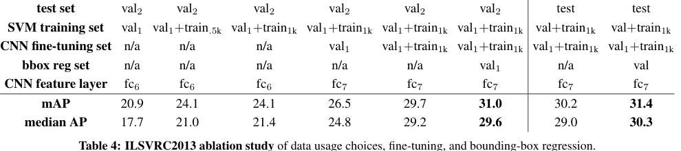

**重点**

- 表 4 证明 `val2` 与 test 走势一致，因此前面的验证选择比较可信。
- 也再次说明 R-CNN 的两个核心机制：迁移微调和定位修正。

## 4.6 Relationship to OverFeat

### 第 10 段：R-CNN 与 OverFeat 的关系

**原文对照**

> There is an interesting relationship between R-CNN and OverFeat: OverFeat can be seen (roughly) as a special case of R-CNN.

> It is worth noting that OverFeat has a significant speed advantage over R-CNN: it is about 9x faster.

OverFeat 可以粗略看成 R-CNN 的特殊情况：把 selective search proposals 换成多尺度规则方窗金字塔，把每类 bbox regressor 换成单一 regressor，两者就很接近。但 OverFeat 约快 `9x`，因为滑窗共享卷积计算，不需要逐 proposal 图像级 warp。

**译文**

作者指出，OverFeat 和 R-CNN 之间有一个有趣关系：OverFeat 可以粗略看作 R-CNN 的一个特例。如果把 R-CNN 的 Selective Search 区域候选换成多尺度金字塔上的规则正方形窗口，并把每类一个的 bbox regressors 改成单个 bbox regressor，那么两者会非常相似。当然，它们在训练方式上仍有差异，例如是否做检测 fine-tuning、是否使用 SVM 等。值得注意的是，OverFeat 有明显速度优势：根据 OverFeat 论文报告的每图约 2 秒，它大约比 R-CNN 快 `9` 倍。这是因为 OverFeat 的滑动窗口不需要在图像层面逐个 warp，重叠窗口之间的计算可以共享；这种共享通过把整个网络以卷积方式运行在任意尺寸输入上实现。作者认为 R-CNN 也可以通过多种方式加速，但这留给未来工作。

**重点**

- R-CNN 更准确，OverFeat 更快。
- 这个段落自然指向后来的 SPP-Net、Fast R-CNN：共享整图卷积特征，避免逐 proposal 重复计算。

**问题与解答**

- **问题：为什么 OverFeat 快？**  
  因为它在整张图上卷积式运行网络，滑窗共享大量中间计算；R-CNN 则对每个 proposal 单独 warp 并跑 CNN。
- **问题：R-CNN 和 OverFeat 是完全对立路线吗？**  
  不是。它们都可看作“候选窗口 + CNN 特征 + 分类/回归”，只是候选窗口来源和计算共享方式不同。

---

# 5 Semantic segmentation

### 第 1 段：把 R-CNN 用到语义分割

**原文对照**

> Region classification is a standard technique for semantic segmentation, allowing us to easily apply R-CNN to the PASCAL VOC segmentation challenge.

> O2P uses CPMC to generate 150 region proposals per image and then predicts the quality of each region, for each class, using support vector regression.

区域分类是语义分割中的常见技术，因此 R-CNN 很容易应用到 PASCAL VOC segmentation。作者在 O2P 的开源框架中比较。O2P 使用 CPMC 每图生成 150 个区域，并用 SVR 为每类预测区域质量。

**译文**

区域分类本来就是语义分割中的标准技术，所以作者可以自然地把 R-CNN 应用于 PASCAL VOC 分割挑战。为了与当时领先的 O2P 方法直接比较，作者使用 O2P 的开源框架。O2P 使用 CPMC 每张图生成 150 个区域候选，然后对每个区域、每个类别使用支持向量回归预测区域质量。O2P 的强性能来自高质量 CPMC 区域，以及对多种手工特征进行二阶池化的强表示。作者也提到，Farabet 等人曾把 CNN 用作多尺度逐像素分类器，在若干 dense labeling 数据集上取得较好结果，但不包括 PASCAL。

**重点**

- R-CNN 的“区域 + 特征 + 分类/回归”框架不仅适合检测，也能迁移到分割。
- 分割这里不是重新设计全新模型，而是把 CNN 特征接入已有区域分割框架。

### 第 2 段：分割实验协议

**原文对照**

> We follow [2, 4] and extend the PASCAL segmentation training set to include the extra annotations made available by Hariharan et al.

作者按已有工作扩展 PASCAL segmentation 训练集，加入 Hariharan 等人的额外标注；设计选择和超参数在 VOC 2011 val 上交叉验证，最终 test 只评估一次。

**译文**

作者按照前人工作扩展 PASCAL segmentation 训练集，加入 Hariharan 等人提供的额外标注。所有设计选择和超参数都在 VOC 2011 validation set 上交叉验证，最终 test 结果只评估一次。

**重点**

- 分割实验保持较规范的验证/测试流程。

### 第 3 段：三种 CNN 分割特征

**原文对照**

> We evaluate three strategies for computing features on CPMC regions, all of which begin by warping the rectangular window around the region to 227x227.

> The third strategy (full+fg) simply concatenates the full and fg features; our experiments validate their complementarity.

作者比较三种 CPMC 区域特征：`full`、`fg`、`full+fg`。三者都先把区域外接矩形 warp 到 `227x227`。`full` 使用整个外接矩形；`fg` 只保留前景 mask，把背景替换为均值；`full+fg` 拼接两者。

**译文**

作者评估三种为 CPMC 区域计算 CNN 特征的策略。三者都先把区域的矩形外接窗口 warp 到 `227 x 227`。第一种 `full` 忽略区域的非矩形形状，直接在 warped window 上计算 CNN 特征，与检测中的处理相同；缺点是两个外接框相似但真实 mask 很不重叠的区域，会得到过于相似的输入。第二种 `fg` 只在区域前景 mask 上计算特征，把背景替换为图像均值，使均值减法之后背景区域接近 0。第三种 `full+fg` 直接拼接 `full` 和 `fg` 特征，实验验证两者互补。

**重点**

- `full` 提供上下文。
- `fg` 提供区域形状和前景内容。
- `full+fg` 同时利用上下文与 mask 内部信息。

### 表 5：VOC 2011 val 分割结果

**译文**

表 5 在 VOC 2011 validation set 上比较 O2P 和六种 R-CNN 特征。O2P 平均准确率为 `46.4%`。单独使用 `full R-CNN fc6` 为 `43.0%`，`fg R-CNN fc6` 为 `43.7%`；最佳是 `full+fg R-CNN fc6`，达到 `47.9%`。同一策略下，`fc6` 始终优于 `fc7`。

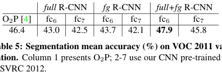

**重点**

- 分割里 `fc6` 优于 `fc7`，和检测 fine-tuning 后 `fc7` 最强不同。
- `full+fg` 说明上下文和前景形状互补。

### 第 4 段：VOC 2011 val 结果解释

**译文**

在每种特征计算策略内，`fc6` 都比 `fc7` 表现更好，因此作者后续主要讨论 `fc6`。`fg` 略优于 `full`，说明使用 mask 前景形状确实提供了更强信号，符合直觉。但 `full+fg` 达到 `47.9%`，比其他 R-CNN 设置高出明显一截，也略优于 O2P。这说明即使已经有 `fg` 前景特征，`full` 中包含的上下文仍然非常有信息量。此外，训练 `full+fg` 特征上的 20 个 SVR 只需要单核约 1 小时，而 O2P 特征训练需要 10 小时以上。

**重点**

- CNN 特征不仅精度强，而且训练后端分类/回归器更快。

### 表 6：VOC 2011 test 分割结果

**译文**

表 6 在 VOC 2011 test set 上比较 R&P、O2P 和作者最好的 `fc6(full+fg)` R-CNN。R-CNN 在 21 个类别中的 11 个取得最高准确率，平均准确率 `47.9%`，高于 R&P 的 `40.8%`，与 O2P 的 `47.6%` 基本打平并略高。作者指出，如果对分割任务进一步 fine-tune，性能可能还能提升。

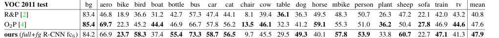

**重点**

- 即使没有针对分割 fine-tuning，CNN 特征也能达到当时顶级分割性能。
- 这强化了论文标题中的 “semantic segmentation”：R-CNN 的 rich features 不只服务检测。

**问题与解答**

- **问题：分割里的 region 和检测里的 region 一样吗？**  
  不完全一样。检测里主要是矩形 boxes；分割里使用 CPMC 产生的候选区域 mask。
- **问题：为什么 `full+fg` 比单独 `fg` 好？**  
  物体类别常依赖上下文，例如桌面、道路、水面或周围物体；只看 mask 内部会丢失这些信息。

---

# 6 Conclusion

### 第 1 段：总结两个核心洞见

**原文对照**

> This paper presents a simple and scalable object detection algorithm that gives a 30% relative improvement over the best previous results on PASCAL VOC 2012.

> We achieved this performance through two insights. The first is to apply high-capacity convolutional neural networks to bottom-up region proposals. The second is a paradigm for training large CNNs when labeled training data is scarce.

作者回顾：检测性能多年停滞，强系统依赖复杂集成、低层特征和上下文。R-CNN 是简单可扩展的算法，在 VOC 2012 上相对提升约 `30%`。成功来自两个洞见：高容量 CNN 用于 bottom-up region proposals；数据少时先有监督预训练，再任务内 fine-tuning。

**译文**

作者总结说，近几年目标检测性能曾经停滞，表现最好的系统往往是复杂集成，组合多种底层图像特征、目标检测器和场景分类器带来的高层上下文。本文提出一种简单且可扩展的目标检测算法，在 PASCAL VOC 2012 上相比此前最佳结果获得约 `30%` 的相对提升。这个性能来自两个洞见：第一，把高容量 CNN 应用于自底向上的区域候选，以定位和分割物体；第二，当目标任务标注稀缺时，先在大规模辅助任务上进行有监督预训练，再对目标任务进行领域内 fine-tuning。作者推测，“有监督预训练 + 领域特定微调”这一范式会对许多数据稀缺的视觉问题有效。

**重点**

- 这段是全文主线的最终回扣。
- 今天看很普通的 transfer learning，在这篇论文中是关键方法论贡献。

### 第 2 段：传统视觉与深度学习不是对立面

**原文对照**

> We conclude by noting that it is significant that we achieved these results by using a combination of classical tools from computer vision and deep learning.

> Rather than opposing lines of scientific inquiry, the two are natural and inevitable partners.

作者强调结果来自经典计算机视觉工具和深度学习的结合：bottom-up region proposals 与 CNN 是自然伙伴。

**译文**

作者最后指出，本文结果的重要性还在于它结合了经典计算机视觉工具和深度学习：自底向上的区域候选来自传统视觉，卷积神经网络来自深度学习。二者不是彼此对立的研究路线，而是自然且不可避免的合作伙伴。

**重点**

- R-CNN 的历史意义正在这里：它不是纯 CNN 替代所有东西，而是把 proposal 机制与 CNN 表示结合起来。
- 后续 Fast R-CNN、Faster R-CNN 也是沿着“保留区域思想、让网络承担更多组件”的方向演化。

### Acknowledgments 致谢

**译文**

作者感谢 DARPA、NSF、MURI、Toyota 等项目支持，并感谢 NVIDIA 捐赠研究使用的 GPU。

**重点**

- 这一段不影响算法理解，但反映了当时训练大型 CNN 对 GPU 资源的依赖。

---

# Appendix 附录

## A Object proposal transformations

### 附录 A 第 1 段：为什么要变换 proposal

**原文对照**

> The convolutional neural network used in this work requires a fixed-size input of 227x227 pixels. For detection, we consider object proposals that are arbitrary image rectangles.

CNN 要求固定 `227x227` 输入，但检测 proposal 是任意矩形。作者比较了两大类变换：包成正方形后等比例缩放，以及直接 warp。

**译文**

本文使用的 CNN 需要固定大小的 `227 x 227` 输入，而检测中的 object proposals 是任意图像矩形。因此作者评估了把 proposal 转换成合法 CNN 输入的不同方法。第一类方法是用最紧的正方形包住 proposal，再把该正方形内的图像等比例缩放到 CNN 输入大小；它还有一个变体，即不保留原 proposal 周围的上下文。第二类方法是 `warp`，也就是把 proposal 各向异性缩放到 CNN 输入大小，允许宽高比发生变化。

**重点**

- `tightest square` 保持比例，但可能引入更多背景。
- `warp` 简单直接，但会改变宽高比。

### 附录 A 第 2 段：context padding 与最终选择

**原文对照**

> For each of these transformations, we also consider including additional image context around the original object proposal.

> A pilot set of experiments showed that warping with context padding (p = 16 pixels) outperformed the alternatives by a large margin (3-5 mAP points).

每种变换都可以加上下文 padding，`p` 定义为变换后坐标系中围绕原 proposal 的边界宽度。超出图像的部分用图像均值填充。预实验发现 `warp + p=16` 比其他方法高 `3-5` 个 mAP 点。

**译文**

对每种变换方式，作者还考虑加入 proposal 周围的额外上下文。padding 大小 `p` 定义为变换后输入坐标系中，原 proposal 四周保留的边界宽度。图 7 展示了 `p=0` 和 `p=16` 的对比。如果源矩形超出原图范围，缺失部分用图像均值填充；随后输入网络前会做均值减法。预实验表明，带上下文 padding 的 warp，即 `p=16`，比替代方案明显更好，提升约 `3-5` 个 mAP 点。作者没有穷举更多替代方案，把这留给未来工作。

**重点**

- 论文主体选择 warp，不是因为它理论上最精致，而是简单且实验效果最好。
- 上下文对检测很重要，`p=16` 后续成为 R-CNN 输入处理的关键细节。

### 图 7 图注：四种 proposal 变换

**译文**

图 7 比较 proposal 变换方式：A 是原始 proposal 在变换输入中的相对大小；B 是带上下文的最紧正方形；C 是不含上下文的最紧正方形；D 是 warp。每个例子的上排是 `p=0`，下排是 `p=16`。

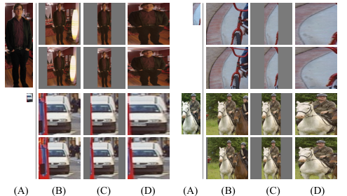

**问题与解答**

- **问题：为什么 warp 反而比保持比例更好？**  
  因为 CNN 最终要处理固定尺寸输入，warp 虽有形变，但能让 proposal 内容充分占据输入；再加上下文后，分类信号更完整。

## B Positive vs. negative examples and softmax

### 附录 B 第 1 段：fine-tuning 与 SVM 标签定义不同

**原文对照**

> For fine-tuning we map each object proposal to the ground-truth instance with which it has maximum IoU overlap and label it as a positive if the IoU is at least 0.5.

> For training SVMs, in contrast, we take only the ground-truth boxes as positive examples.

Fine-tuning：proposal 与某 ground-truth 最大 IoU 至少 `0.5`，则作为该类正例，否则为背景。SVM：只有 ground-truth boxes 是正例；与某类所有实例 IoU 小于 `0.3` 的 proposals 是该类负例；灰区 proposals 忽略。

**译文**

作者进一步讨论两个设计选择。第一个问题是：为什么 CNN fine-tuning 和检测 SVM 训练使用不同的正负样本定义？回顾规则：fine-tuning 时，每个 proposal 被分配给与它 IoU 最大的 ground-truth instance，如果 IoU 至少 `0.5`，就作为对应类别正样本；其他 proposal 都标为背景。SVM 训练则不同：只有 ground-truth boxes 被当作对应类别正样本；对某一类别而言，与该类所有实例 IoU 都小于 `0.3` 的 proposals 被当作负样本；IoU 大于 `0.3` 但又不是 ground truth 的灰区 proposals 被忽略。

**重点**

- Fine-tuning 的正例更宽松。
- SVM 的正例更严格，负例更强调 hard negatives。

### 附录 B 第 2-3 段：为什么会形成这套规则

**译文**

历史上，作者最初只用 ImageNet 预训练 CNN 提特征，再训练 SVM，当时还没有 fine-tuning。在那个设置下，他们发现当前 SVM 标签定义在评估过的选项中最好。后来加入 fine-tuning 时，作者一开始也尝试用同样的 SVM 标签定义，但结果明显更差。作者推测，这种差异不是根本原则，而是因为 detection fine-tuning 数据太少。当前 fine-tuning 规则引入了大量 jittered examples，即 IoU 在 `0.5` 到 `1` 之间但不是 ground truth 的 proposals，使正样本数量扩大约 `30` 倍。微调整个网络时，这么多正样本有助于避免过拟合。不过作者也承认，这些 jittered examples 可能不是最优，因为网络并没有直接被训练成精确定位器。

**重点**

- Fine-tuning 需要样本量，所以放宽正例。
- SVM 负责最终精确分类边界，所以使用更严格标签和 hard negatives。

### 附录 B 第 4-5 段：为什么还要 SVM，而不直接用 softmax

**译文**

第二个问题是：既然 CNN 已经 fine-tune 过，为什么还要训练 SVM？更简洁的做法是直接使用 fine-tuned CNN 最后一层 `21-way softmax` 作为检测器。作者试过这个方案，VOC 2007 mAP 从使用 SVM 的 `54.2%` 降到 `50.9%`。性能下降可能来自多个因素：fine-tuning 的正例定义不强调精确定位；softmax 使用随机采样负例训练，而 SVM 使用 hard negative mining 得到的困难负例。尽管如此，这个结果也说明不训练 SVM 仍然可以接近完整系统性能。作者猜测，如果进一步调整 fine-tuning，剩余差距可能被消除，从而简化并加速 R-CNN 训练。

**重点**

- SVM 的优势主要来自更合适的检测标签规则和 hard negative mining。
- 后来 Fast R-CNN 确实走向了去掉外部 SVM、直接端到端训练 softmax 分类器。

**问题与解答**

- **问题：fine-tuning 的背景类是否等价于每类 SVM 的负类？**  
  不等价。Fine-tuning 背景是统一背景类；SVM 是每个类别独立训练，该类别的负样本定义更细。

## C Bounding-box regression

### 附录 C 第 1 段：bbox regression 的位置

**原文对照**

> After scoring each selective search proposal with a class-specific detection SVM, we predict a new bounding box for the detection using a class-specific bounding-box regressor.

每个 selective search proposal 先由类别 SVM 打分，然后类别专属 bbox regressor 预测新框。它与 DPM bbox regression 精神相似，但输入特征从 DPM 几何特征换成 CNN 特征。

**译文**

边界框回归用于改善定位。每个 Selective Search proposal 先由类别专属检测 SVM 打分，然后由类别专属 bounding-box regressor 为该检测预测一个新的框。这个思想与 DPM 中的 bbox regression 类似，但 R-CNN 的回归器从 CNN 计算的特征出发，而不是从 DPM 部件位置的几何特征出发。

**重点**

- 先分类打分，再对高分检测做框修正。
- 每个类别有自己的回归器。

### 附录 C 第 2-4 段：回归公式

**译文**

训练输入是一组 `(P, G)`，其中 `P=(Px, Py, Pw, Ph)` 表示 proposal 框中心坐标及宽高，`G=(Gx, Gy, Gw, Gh)` 表示对应 ground-truth 框。目标是学习一个变换，把 proposal `P` 映射到更接近 `G` 的预测框。

模型学习四个函数 `dx(P)`、`dy(P)`、`dw(P)`、`dh(P)`。前两个表示中心位置的尺度不变平移，后两个表示宽高在 log 空间中的变化。预测框为：

$$
\hat{G}_x=P_wd_x(P)+P_x,\qquad
\hat{G}_y=P_hd_y(P)+P_y
$$

$$
\hat{G}_w=P_w\exp(d_w(P)),\qquad
\hat{G}_h=P_h\exp(d_h(P))
$$

每个函数都是 proposal 的 `pool5` 特征 $\phi_5(P)$ 的线性函数：

$$
d_\star(P)=w_\star^T\phi_5(P),\qquad \star\in\{x,y,w,h\}
$$

训练时使用带 L2 正则的最小二乘，也就是 ridge regression。

**重点**

- 平移用相对位移，尺度用对数比例。
- 输入特征是 `pool5`，不是最终 SVM 分数。

### 附录 C 第 5-7 段：训练目标、样本选择和是否迭代

**译文**

训练目标定义为：

$$
t_x=(G_x-P_x)/P_w,\qquad t_y=(G_y-P_y)/P_h
$$

$$
t_w=\log(G_w/P_w),\qquad t_h=\log(G_h/P_h)
$$

作者实现时发现两个细节很重要。第一，正则化很重要，验证集上选择 `lambda = 1000`。第二，训练 pair 的选择必须谨慎。如果 proposal `P` 离所有真实框都很远，那么把它变换成某个 ground truth `G` 并不合理，会让学习问题变得混乱。因此，只有当 `P` 与某个 ground-truth box 的最大 IoU 大于阈值时才使用；该阈值在验证集上设为 `0.6`。没有被分配到 ground truth 的 proposals 直接丢弃。这个过程对每个类别分别进行，以学习类别专属 bbox regressors。测试时，每个 proposal 只预测一次新窗口；作者尝试过迭代地重新打分、重新预测，但没有改善结果。

**重点**

- `IoU > 0.6` 表示回归器只学习“微调接近目标的框”。
- 不迭代说明一次线性修正已经捕获主要定位误差。

## D Additional feature visualizations

### 附录 D：更多 pool5 unit 可视化

**原文对照**

> Figure 12 shows additional visualizations for 20 pool5 units. For each unit, we show the 24 region proposals that maximally activate that unit out of the full set of approximately 10 million regions in all of VOC 2007 test.

**译文**

附录 D 的图 12 展示额外 20 个 `pool5` units 的可视化。对每个 unit，作者从 VOC 2007 test 的约 1000 万个 regions 中取出激活最大的 24 个 region proposals。每个 unit 用它在 `6 x 6 x 256` 的 `pool5` feature map 中的位置 `(y, x, channel)` 标记。同一 channel 内，CNN 对输入区域计算的是同一个函数；`y,x` 位置变化只改变感受野位置。

**重点**

- 同一 channel 是同一种检测模式在不同空间位置上的响应。
- 这补充说明第 3.1 节：CNN 的中间层并非黑箱，它确实学到纹理、部件、形状等可解释模式。

## E Per-category segmentation results

### 附录 E：分割逐类结果

**原文对照**

> In Table 7 we show the per-category segmentation accuracy on VOC 2011 val for each of our six segmentation methods in addition to the O2P method.

**译文**

附录 E 的表 7 给出 VOC 2011 validation set 上每个类别的分割准确率，比较 O2P 以及六种 R-CNN 分割特征设置。类别包括 20 个 PASCAL 类和 background。该表的作用是说明平均准确率背后的类别差异：有些类别更受益于 `fg` mask，有些类别更依赖 `full` 上下文，而 `full+fg` 的平均优势来自二者互补。

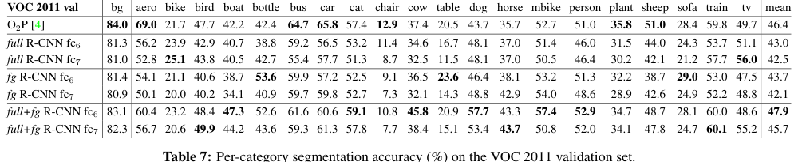

**重点**

- 平均值会掩盖类别差异，逐类表用于诊断哪些类别受益最大。

## 附表：ILSVRC2013 每类 AP

**译文**

表 8 给出 ILSVRC2013 detection test set 上 200 个类别的逐类 AP。它补充图 3 的箱线图：mAP `31.4%` 是整体平均，但不同类别差异很大，部分类别 AP 很高，另一些小物体、细长物体或视觉差异微弱的类别 AP 很低。

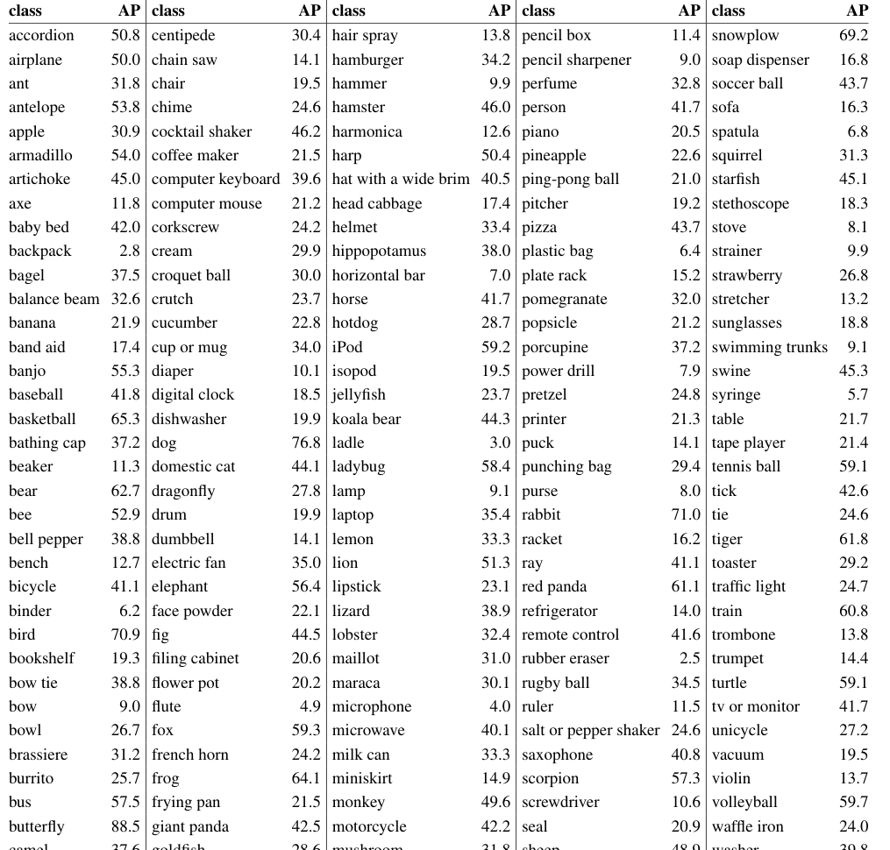

**重点**

- 逐类 AP 能帮助判断错误是否集中在少数类别，也能看出大规模 200 类检测比 PASCAL 20 类更不均衡。

## F Analysis of cross-dataset redundancy

### 附录 F 第 1 段：为什么检查数据集重复

**原文对照**

> One concern when training on an auxiliary dataset is that there might be redundancy between it and the test set.

> We still conducted a thorough investigation that quantifies the extent to which PASCAL test images are contained within the ILSVRC 2012 training and validation sets.

使用辅助数据集预训练时，一个担忧是辅助训练集与测试集有重复。虽然分类预训练和检测测试任务不同，重复风险没那么严重，作者仍检查 PASCAL test 是否包含在 ILSVRC2012 train/val 中。

**译文**

当使用辅助数据集预训练时，一个自然担忧是：辅助训练集里是否有测试集图片或近重复图片？虽然整图分类和目标检测任务差异很大，这种跨集合重复不像同任务训练/测试泄漏那么严重，但作者仍然做了仔细检查，量化 PASCAL test 图片在 ILSVRC2012 train/val 中出现的程度。这些发现也能帮助后来想用 ILSVRC2012 训练 PASCAL 图像分类任务的研究者。

**重点**

- 这是实验可信度检查：确认 ImageNet 预训练没有大量“见过”PASCAL 测试图。

### 附录 F 第 2-4 段：两种重复检测与结果

**原文对照**

> This check turned up 31 matches out of 4952 (0.63%).

> Euclidean distance nearest-neighbor matching of GIST descriptors revealed 38 near-duplicate images.

> Based on GIST matches, 1.5% of VOC 2012 test images are in ILSVRC 2012 trainval.

**译文**

作者做了两种重复或近重复检测。第一种利用 Flickr image IDs 的精确匹配；VOC 2007 test 标注中包含这些 ID，而后续 PASCAL test 的 ID 被保密。由于所有 PASCAL 图片和大约一半 ILSVRC 图片来自 Flickr，这个检查找到 `31/4952` 张匹配，比例为 `0.63%`。第二种方法使用 GIST 描述子做近重复图像检索。作者把 ILSVRC2012 trainval 和 PASCAL 2007 test 图片都 warp 成 `32 x 32`，计算 GIST，再做欧氏距离最近邻匹配。该方法找到 38 张近重复图片，其中包括前面 31 张 Flickr ID 匹配；这些匹配通常只是 JPEG 压缩、分辨率或轻微裁剪不同。总体重叠小于 `1%`。对 VOC 2012，由于没有 Flickr IDs，作者只用 GIST 方法，发现 VOC 2012 test 中约 `1.5%` 出现在 ILSVRC2012 trainval 中；稍高的比例可能是因为 VOC 2012 与 ILSVRC2012 收集时间更接近。

**重点**

- 数据重叠存在但很小，不足以解释 R-CNN 的大幅提升。
- 这增强了“预训练学到可迁移表示”而不是“测试集泄漏”的可信度。

## G Document changelog

### 附录 G：论文版本变化

**原文对照**

> v2 CVPR 2014 camera-ready revision. Includes substantial improvements in detection performance brought about by (1) starting fine-tuning from a higher learning rate, (2) using context padding, and (3) bounding-box regression.

> v5 Added results using the new 16-layer network architecture from Simonyan and Zisserman.

**译文**

附录 G 记录 arXiv 文档版本变化。`v1` 是初版。`v2` 是 CVPR 2014 camera-ready，包含检测性能的大幅改进，主要来自三点：fine-tuning 初始学习率从 `0.0001` 提高到 `0.001`，准备 CNN 输入时加入 context padding，以及使用 bounding-box regression 修复定位错误。`v3` 把 ILSVRC2013 检测结果和与 OverFeat 的比较整合进多个章节，主要是第 2 节和第 4 节。`v4` 修正了附录 B 中 softmax vs. SVM 结果的错误。`v5` 在第 3.3 节和表 3 中加入 Simonyan 和 Zisserman 的 16 层网络结果。

**重点**

- 版本变化说明 R-CNN 不是一次性完成的系统，关键工程细节显著改变最终性能。
- `v5` 中 O-Net/VGG 结果把 R-CNN 从 AlexNet 时代连接到更深网络时代。

---

# 按原文走完全篇后，应能回答的问题

1. R-CNN 解决分类迁移到检测的两个难点分别是什么？
2. 为什么 Selective Search 的候选区域要被 warp 成 `227 x 227`？
3. 测试时 CNN、SVM 和 NMS 分别做什么？
4. Fine-tuning 标签规则与 SVM 标签规则为何不同？
5. `pool5` 的 `6 x 6 x 256` 和 `195 x 195` 分别如何推导？
6. 为什么未 fine-tune 时 `fc6` 优于 `fc7`，但 fine-tune 后 `fc7` 最佳？
7. 为什么错误分析自然导向 bounding-box regression？
8. 为什么更深的 O-Net 提高精度的同时，也让 R-CNN 的速度问题更突出？
9. ILSVRC2013 中为什么不能从 `train` split 挖 hard negatives？
10. `val1+trainN` 中的 `trainN` 扮演什么角色？
11. R-CNN 与 OverFeat 的共同点和关键差异是什么？
12. 语义分割实验中 `full`、`fg`、`full+fg` 三种特征分别表示什么？
13. 附录 A 中为什么最终选择 `warp + p=16`？
14. 附录 F 如何排查 ImageNet 预训练与 PASCAL test 的数据重复？

## 核心数字速查

| 原文位置 | 结果或设置 | 含义 |
| --- | ---: | --- |
| Abstract | VOC 2012 `53.3% mAP` | 摘要主结果 |
| Figure 1 | VOC 2010 `53.7% mAP` | R-CNN + BB |
| Introduction | ILSVRC2013 `31.4%` vs OverFeat `24.3%` | 区域范式的大规模比较 |
| 2.2 | 每图约 `2000` proposals | 测试候选规模 |
| 2.3 | Fine-tuning `IoU >= 0.5` | CNN proposal 正例 |
| 2.3 | SVM negatives `IoU < 0.3` | 最终分类器负例 |
| 3.1 | `pool5 = 6 x 6 x 256` | 卷积表示维度 |
| 3.1 | receptive field `195 x 195` | 深层 unit 视野 |
| 3.2 | FT `fc7 = 54.2%`，加 BB `58.5%` | 微调与定位修正价值 |
| 3.3 | O-Net BB `66.0%` | 更深 backbone 的收益 |
| 3.5/附录 | BB train `IoU > 0.6` | 回归训练邻近框规则 |
| 4.1 | ILSVRC train/val/test `395,918 / 20,121 / 40,152` | 大规模检测划分 |
| 4.2 | ILSVRC proposals `2403`/图，召回 `91.6%` | proposal 阶段瓶颈 |
| 4.5 | ILSVRC val2 `31.0%`，test `31.4%` | 大规模检测最终设置 |
| 5 | VOC 2011 segmentation `47.9%` | R-CNN 特征可迁移到分割 |
| 附录 A | `warp + p=16` 高 `3-5` mAP | 输入变换细节重要 |
| 附录 B | softmax `50.9%` vs SVM `54.2%` | SVM/hard negatives 的收益 |
| 附录 F | VOC 2007 重复 `<1%`，VOC 2012 `1.5%` | 排查预训练数据重叠 |

## 来源

- 本地论文：[`1311.2524v5.pdf`](1311.2524v5.pdf)
- 官方页面：[arXiv:1311.2524](https://arxiv.org/abs/1311.2524)
- 图示资源：[`assets/rcnn-notes/`](assets/rcnn-notes/)

